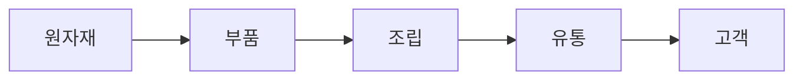
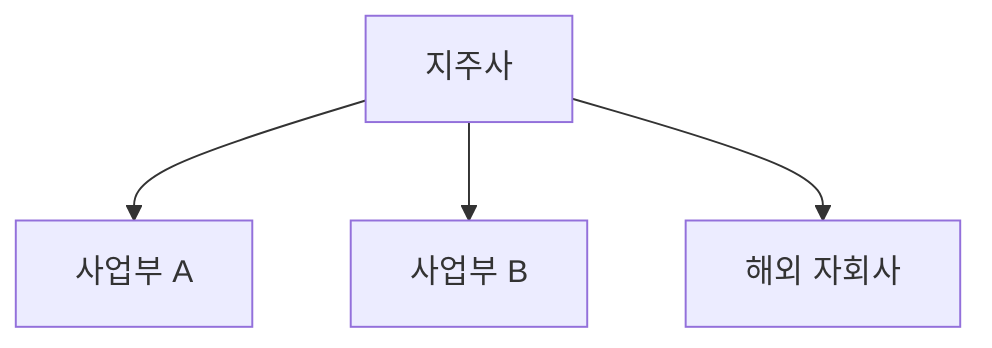

# GIC 기업 리서치보고서 — 정식 프롬프트 시스템 v11.0

> **버전**: v11.0
> **작성일**: 2026-05-14
> **대상**: Gachon Investment Club (GIC) 4기 — 비전공자 부원 포함
> **호환 AI 도구**: Claude · ChatGPT · Gemini · Perplexity (웹 챗봇 복붙 100% 완결)
> **핵심 변화 (v9.0 → v11.0)**: HTML(A4 가로) 양식 자동 출력 + CSV/Excel 데이터 파일 + 웹검색 의무화 + 프롬프트 메타 리포트 슬라이드

---

## 0. 사용 방법

이 문서는 **9단계 모듈형 프롬프트**입니다. 각 Step 본문 끝의 4중 백틱 펜스(```` ```` ````) 안에 든 프롬프트를 **AI 챗봇에 그대로 복사-붙여넣기** 하고, `[대괄호]` 안 내용을 본인 분석 대상에 맞게 채우세요.

**API 키, 별도 웹앱, MCP 서버, Python 코드 모두 불필요합니다.**

### 실행 순서 (정식 코스)
Step 0 → 1 → 2 → 3 → 4 → 5 → **5.5** → 6 → 7 → 8 → **9 (v11.0 신규)**

### v11.0 산출물 (Step 8 + Step 9에서 생성)
1. **HTML 리포트** (10~20p, A4 가로) — 브라우저 인쇄로 PDF 변환
2. **CSV 데이터 파일** (재무·밸류에이션·피어 비교) — Excel에서 열기
3. **Excel 파일** (Code Interpreter 사용 가능 시) — 수식·차트 포함
4. **프롬프트 엔지니어링 메타 HTML** (Step 9) — 사용한 기법 설명

### 횡단 원칙 — 10개 블록 라이브러리

| 블록 | 이름 | 역할 |
|---|---|---|
| A | 용어 번역기 | 비전공자가 모르는 단어에 10자 풀이 자동 부착 |
| B | Sanity Check | 1차원 인과 점검 후 매개변수 보강 |
| C | 핵심 비유 | 산업·기업을 일상 서비스에 빗댄 한 줄 |
| D | Mermaid | 밸류체인·지배구조를 다이어그램 코드로 출력 |
| E | 검증 태그 | 의심 수치에 `[검증 필요]` 부착 |
| F | Red Team | Short Seller 페르소나로 투자 논리 공격 |
| G | Evidence Card | 모든 핵심 가정에 근거 3건 + 출처 + 신뢰도 |
| H | AD-FCoT | 과거 유사 기업·산업 사례를 인용한 인과 추론 |
| I | 5개년 Forward 모델링 | Blended CAGR + 3-Statement 연결 + 시나리오 매트릭스 |
| J | Anti-Hallucination Protocol | 추측 금지·Missing Data 처리·필수 인용·시점 표기 |

### v11.0 신규 횡단 원칙

| 원칙 | 내용 |
|---|---|
| **W (Web Search)** | 모든 시장 가격·시총·뉴스는 챗봇 내장 웹검색으로 갱신 + URL 첨부 의무 |
| **X (eXport)** | 재무·밸류·피어 표는 csv 코드블록으로 동시 출력 |
| **P (Page-safe HTML)** | Step 8 HTML은 A4 가로 + `page-break-after: always` + `break-inside: avoid` |
| **M (Meta Prompt)** | Step 9에서 사용한 프롬프트 기법(블록·6-Lens 등)을 별도 HTML로 설명 |

---

## ⚠️ 코드블록 표기 규칙 (v9.0 계승)

본 문서의 모든 단계별 프롬프트는 **외부 4중 백틱 펜스**(```` ```` ````)로 감쌉니다. 내부에 ```mermaid 같은 3중 백틱이 들어가도 잘리지 않습니다.

복사 방법:
1. 4중 백틱 펜스 안의 텍스트 전체 선택
2. 4중 백틱 줄(시작·끝)은 **포함하지 말고** 내부만 복사
3. AI 챗봇에 붙여넣기 — 그대로 동작

---

## 0단계 — 초기 설정 + 웹검색 활성화 확인

````
당신은 가천대학교 투자 동아리 GIC 소속 기업 리서치 애널리스트입니다.
지금부터 기업 리서치 보고서를 단계별로 작성합니다.

[v11.0 W원칙 — 웹검색 의무화]
이번 분석 전체에서 챗봇 내장 웹검색(Claude Search / ChatGPT Web Browse / Gemini Search Grounding / Perplexity 기본)을 활성화하라.
모든 시장 가격·시총·최신 뉴스·컨센서스는 웹검색 결과에서 인용 + URL 첨부.
검색이 비활성이면 "웹검색 비활성 — 활성화 후 재시도 권장" 경고를 첫 줄에 출력.

■ 분석 대상 기업: [기업명] ([종목코드])
■ 섹터 분류: [인프라/금융/반도체/로봇/조선/방산/소비재/바이오/AI 중 택1]
■ 분석 기준일: [YYYY.MM.DD]
■ 분석 관점: [성장주/가치주/턴어라운드/배당/테마 중 1~복수]
■ 독자 수준: [초급/중급/전문가]
■ 투자포인트 개수: [기본 3]
■ 투자리스크 개수: [기본 2]
■ Forward 추정 기간: [기본 5개년: FY1~FY5]

[블록 J 적용 — Anti-Hallucination Protocol]
1. 모든 수치는 검증 가능한 공개 자료에서만 인용 (≤24개월 이내).
2. 추측 금지 — 모르는 값은 "Data unavailable / unverifiable"로 표기.
3. 출처 충돌 시 → "Conflicting data found; here is the range" + 범위 명시.
4. 각 핵심 수치 옆에 (출처: OOO, YYYY.MM, URL) 표기 의무. ← v11.0: URL 명시
5. 시점 표기 의무 — "FY23", "최근 거래일 종가 기준 YYYY-MM-DD" 등.
6. Missing Data Protocol: 데이터 부재 시 분석 중단 X. 점수 페널티 + 사유 명시 + 분석 계속.

[출력 — Step 0 답변]
1. 기업 개요 1줄 요약 (웹검색으로 확인한 최신 사업 상태)
2. 현재 주가 + 시가총액 + 52주 고저 (출처 URL 명시)
3. 섹터 핵심 키워드 3~5개
4. 집중 재무 지표 추천 (섹터 특성 반영)
5. 이후 단계 데이터 체크리스트 (DART 사업보고서 URL, 증권사 리서치, 컨센서스 등)
6. 본 분석에서 적용할 블록 (기본: A·B·C·D·E·F·G·H·I·J 모두 활성)
7. v11.0 신규 원칙 활성 확인 (W·X·P·M 모두 ON)

[비전공자 부원 안내]
이 시스템은 챗봇 복붙만으로 동작합니다. 외부 코드·API 키·웹앱 모두 불필요.
모르는 용어가 나오면 알려주세요 — 자동으로 풀이를 붙여 드립니다 (블록 A).
한국 시장 데이터는 사용설명서의 "데이터 수집 가이드" 섹션 참조.

[Claude: Artifacts로 KPI 카드를 미리 만들어두면 이후 단계 일관성 ↑. Search 도구 자동 ON 확인]
[ChatGPT: 메시지 입력란 → 도구 → "웹 검색" 토글 ON 확인. Code Interpreter 권장]
[Gemini: Google Search Grounding 자동 ON 확인 — 출처 URL 자동 첨부]
````

---

## 1단계 — 경쟁사 매핑 (Peer Group)

````
[Step 0 설정 붙여넣기]

위 기업이 속한 섹터에서 사업 모델 유사성을 기준으로 경쟁사를 매핑하라.
[W원칙] 모든 시총·매출은 챗봇 웹검색으로 최신값 갱신 + 출처 URL 첨부.

■ 매핑 기준
- 동일 섹터 내 사업 모델 유사 (국내 + 글로벌)
- 매출 구성·핵심 기술/제품·고객군·밸류체인 포지션
- 국내 ≥3, 글로벌 ≥3
- 대체재·신규 진입자 별도 1~2개

■ 출력 1: 마크다운 표
| 기업명 | 티커 | 국가 | 시가총액 | 주력 사업 | 유사도(상/중/하) | 비고 |

■ 출력 2 (v11.0 X원칙): csv 코드블록 동시 출력
```csv
기업명,티커,국가,시가총액(억원),주력사업,유사도,비고,출처URL
[행 데이터]
```
※ csv는 부원이 .csv 파일로 저장 → Excel에서 바로 열림.

■ 추가
- 각 경쟁사 유사 사유 1줄 (비고 컬럼)
- 시총 규모 비교는 텍스트로 정렬 (HTML 차트 생성 금지)

[블록 E 적용 — 검증 태그]
시가총액·매출 수치 중 의심스러운 값에 [검증 필요] 태그 부착하고
답변 끝에 [검증 필요] 항목 모음 표 출력.

[블록 J 적용]
출처 미상 수치는 "Data unavailable / unverifiable" 표기 후 분석 계속.
모든 수치 옆 (출처: OOO, YYYY.MM, URL).

[Claude: 표 검토 시 Artifacts로 인터랙티브 정렬 가능]
[ChatGPT: 웹 브라우징으로 글로벌 피어 시총 자동 갱신 + 출처 URL]
[Gemini: Google Search Grounding으로 출처 URL 답변 끝에 자동 첨부]
````

---

## 2단계 — 재무 정량 분석 (CSV·Excel 동시 출력)

> 📎 첨부 권장: DART 재무제표 (재무상태표·손익계산서·현금흐름표 3~5개년)

````
첨부 파일은 [기업명] DART 재무제표다 (또는 본문에 직접 붙인 표).
다음을 수행하라.

[W원칙] 웹검색 미사용 (1차 자료 위주). 단 시장 컨센서스는 웹검색 + URL.
[X원칙] 5개년 재무 데이터를 csv 코드블록으로 동시 출력.

■ 1. 재무제표 파싱 (3~5개년)
- 매출액·매출원가·매출총이익·판관비·영업이익·당기순이익
- 자산총계·부채총계·자본총계·현금성자산·차입금
- 영업CF·투자CF·재무CF·CAPEX
- 단위 통일 (억원/조원, 자릿수 명시)

■ 2. 핵심 지표 (모두 산출)
[수익성] 매출총이익률·영업이익률·순이익률·ROE·ROA·ROIC
[성장성] 매출/영업이익/순이익 YoY + 3년·5년 CAGR
[안정성] 부채비율·유동비율·이자보상배율·순차입금/EBITDA
[효율성] 총자산/재고/매출채권 회전율, 현금전환주기(CCC)
[밸류에이션 기초] EPS·BPS·PER·PBR·EV/EBITDA·배당수익률
[현금흐름] 영업CF·FCF(=영업CF-CAPEX)·CAPEX/매출 비율

■ 3. 출력 1: 마크다운 표 (3~5개년 × 항목)
+ 텍스트 기반 추이 설명만 사용.

■ 4. 출력 2 (v11.0 X원칙): csv 코드블록 — 3개 분리 출력

```csv
# 1) 손익계산서 (단위: 억원)
연도,매출액,매출원가,매출총이익,판관비,영업이익,당기순이익,영업이익률(%),순이익률(%)
FY-2,...
FY-1,...
FY0,...
```

```csv
# 2) 재무상태표 (단위: 억원)
연도,자산총계,부채총계,자본총계,현금성자산,차입금,부채비율(%),유동비율(%)
...
```

```csv
# 3) 현금흐름표 (단위: 억원)
연도,영업CF,투자CF,재무CF,CAPEX,FCF,CAPEX/매출(%)
...
```

[Code Interpreter 사용 가능한 경우 — v11.0 추가]
위 3개 csv를 통합한 .xlsx 파일을 생성하라:
- Sheet 1: 손익계산서 (수식: 영업이익률 = 영업이익/매출 자동 계산)
- Sheet 2: 재무상태표 (Balance Check: 자산=부채+자본)
- Sheet 3: 현금흐름표
- Sheet 4: 비율분석 (ROE·ROIC·CAGR 자동 계산)
파일명: [기업명]_재무분석_v11_[YYYYMMDD].xlsx
다운로드 링크 제공.

■ 5. 분석 코멘트 (각 카테고리 2~3문장)
- 수익성 추세
- 재무 안정성 우려
- 동종 업계 대비 강점/약점

[블록 A 적용 — 용어 번역기]
CAPEX·OPM·ROE·ROIC·EBITDA·FCF·WACC·순운전자본·CCC·EV/EBITDA 등
첫 등장 위치에 (10자 내외 쉬운 풀이)를 괄호로 부착하라.

[블록 E 적용 — 검증 태그]
지표 간 수치 충돌(영업이익률이 직전 단계와 다름 등) 시 [검증 필요] 태그.

[블록 J 적용]
모든 수치에 출처(DART 사업보고서 페이지 또는 추출본 URL)와 시점(FY24, 1Q25 등) 명시.

[Claude: PDF 첨부 직접 가능 — 200K 토큰. 사업보고서 III장 위주로 추출 명시]
[ChatGPT: Code Interpreter로 PDF의 III장 자동 추출 + 표 생성. Excel .xlsx 다운로드 가능]
[Gemini: 2M 토큰 — 100페이지+ 사업보고서 통째 첨부 가능. Sheets 생성 권장]
````

---

## 3단계 — 산업 분석 (웹검색 강화)

````
[Step 0 정보 붙여넣기]

위 기업이 속한 [섹터] 산업분석을 작성하라.
[W원칙 — 의무] 챗봇 내장 웹검색으로 다음 모두 갱신 + 출처 URL 첨부:
- 글로벌·국내 시장 규모 (최신)
- 3~5Y CAGR 추정치 (3개 출처 교차)
- 주요 트렌드 3~5개 (최근 6개월 뉴스)
- 규제·정책 최신 변경
- 사이클 위치 판단의 정량 근거

■ 항목
1. 시장 규모 & 성장 전망
   - 글로벌/국내 금액 (최신)
   - 3~5Y CAGR 추정치 + 출처 URL
   - 주요 성장 동인 3가지
2. 산업 구조 & 경쟁 (Porter 5 Forces 기반)
   - 기존 경쟁자 강도 / 신규 진입자 위협 / 대체재 위협
   - 공급자 교섭력 / 구매자 교섭력
   - 각 항목 강도(강/중/약) + 근거 1줄 + 출처
3. 주요 트렌드 3~5개 (각각 분석 대상에 미치는 영향 + 출처 URL)
4. 규제·정책 환경 (최신 변경 사항 + 출처)
5. 산업 사이클 위치 판단 (도입기/성장기/성숙기/쇠퇴기 + 근거)

■ 출력 (v11.0 X원칙): 시장 규모 5개년 추이를 csv 코드블록으로
```csv
# 시장 규모 추이 (단위: USD bn)
연도,글로벌시장규모,국내시장규모,YoY성장률(%),주요동인,출처URL
...
```

■ 톤: 증권사 리서치 스타일 / 분량: A4 1~1.5p

[블록 C 적용 — 핵심 비유]
본문 최상단에 1문장(≤30자) 비유를 배치하라.
형식: "이 회사는 [산업]의 [대중적 서비스] 같은 존재 — [핵심 차별점]"

[블록 D 적용 — Mermaid]
산업 밸류체인을 별도 섹션의 ```mermaid 코드 블록으로 출력.
노드 5~9개, 한국어 노드명 허용. 부원이 mermaid.live에 붙여 PNG 변환.

[블록 E 적용 — 검증 태그]
시장 규모·CAGR·점유율 수치는 출처 명시 + 의심 시 [검증 필요].

[블록 B 적용 — Sanity Check]
"시장이 성장하니 우리 회사도 성장" 같은 비약이 있다면
점유율·경쟁우위·가격 매개변수를 명시해 보강.

[블록 H 적용 — AD-FCoT]
"과거 [유사 산업/기업]이 [동일 사이클 위치]였을 때 [관찰된 패턴]" 형식의
유사 사례 1건을 산업 사이클 판단 근거로 인용. 차이점 1~2개 명시.

[블록 J 적용]
TrendForce·Yole·KIET 등 출처별 수치가 다르면 범위 명시 + 각 출처 URL.

[Claude: 다출처 교차 검증에 강점. 3출처 인용 후 차이 정리 권장 + Search 자동]
[ChatGPT: 웹 브라우징으로 한경 컨센서스·증권사 리포트 자동 검색 + URL]
[Gemini: Search Grounding이 가장 강한 영역. URL 모음 자동 출력]
````

### 3단계 — Mermaid 별도 섹션 (산업 밸류체인)



> 부원은 mermaid.live에 붙여 PNG로 변환 후 HTML/슬라이드 삽입.

---

## 4단계 — 기업 분석

> 📎 추가 첨부 가능: 사업보고서, IR 자료, 실적발표 자료 (선택)

````
[Step 0 정보 + Step 2 재무 요약 붙여넣기]

기업분석을 작성하라.
[W원칙] 최근 3개월 뉴스·공시는 웹검색 + URL 첨부 의무.

■ 항목
1. 사업 구조 & 매출 구성
   - 사업부/제품별 비중 (최근 + 3년 전 비교)
   - 핵심 수익원 (제품 판매/서비스/구독/라이선스)
   - 고객 집중도 (Top 5 비중)
   - 수출/내수 비중
2. 경쟁 우위 분석 (Economic Moat)
   - 원가 우위·네트워크 효과·전환비용·무형자산(브랜드/특허)·규모의 경제
   - 각 요소 해당 여부 + 근거 1줄
3. 최근 실적
   - 직전 분기/연간 요약
   - YoY 변동 원인
   - 컨센서스 비교 (서프라이즈 또는 미스) [출처 URL]
4. 경영진 & 지배구조
   - 대표이사·핵심 경영진 트랙레코드
   - 최대주주·특수관계인 지분율
   - 지배구조 리스크 (순환출자·사익편취 이력)
5. 주주환원
   - 배당 이력·자사주 매입/소각
   - 향후 확대 가능성
6. 최근 이슈 & 모멘텀 (웹 검색 필수 — v11.0 강화)
   - 최근 3개월 주요 뉴스/공시 5건 (각 출처 URL)
   - 신규 사업·M&A·투자 계획
   - 애널리스트 컨센서스 변화 추이 (출처 URL)

■ 출력 (X원칙): 사업부별 매출 비중을 csv로
```csv
# 사업부별 매출 비중
사업부,FY-2_매출(억),FY-2_비중(%),FY-1_매출(억),FY-1_비중(%),FY0_매출(억),FY0_비중(%)
...
```

■ 톤: 증권사 리서치 스타일 / 분량: A4 1~1.5p

[블록 A 적용] CMO, OEM, B2B/B2C, EBITDA, 영업레버리지, Moat 등 풀이 부착.
[블록 C 적용] 복잡한 사업 구조를 1줄 비유로 본문 최상단에 명시.
[블록 D 적용] 지배구조 또는 사업부 구조를 별도 섹션의 ```mermaid 코드로 출력.
[블록 B 적용] "신제품 출시 → 실적 개선" 같은 비약 → 가격·물량·마진 분해로 보강.
[블록 J 적용] 경영진 이력·지분율 등 사실 수치는 1차 출처(DART/IR) 인용 + URL.

[Claude: Moat 평가에 회의주의 강점. "정말 지속 가능한가?" 자체 점검]
[ChatGPT: 웹 브라우징으로 최근 3개월 뉴스 자동 검색 + URL]
[Gemini: 유튜브 분석 가능 — 실적 발표·IR Day 영상 트랜스크립트 추출]
````

### 4단계 — Mermaid 별도 섹션 (지배구조 또는 사업부 구조)



---

## 5단계 — 투자포인트 & 리스크

````
[Step 0 + Step 2 요약 + Step 3 요약 + Step 4 요약 붙여넣기]

투자포인트 [N]개 + 투자리스크 [M]개 도출하라.

■ 투자포인트 형식 (각 포인트별)
- 소제목 (1문장 핵심 메시지)
- 사이드바 키워드 (≤2줄)
- 본문 (4~6문장, 구체 수치·논거 포함)
- 모니터링 지표 (이 포인트 유효성을 추적할 핵심 지표)
- 신뢰도 (상/중/하) + 판단 근거
- 근거/출처 (URL 포함 — v11.0)

■ 투자리스크 형식 (각 리스크별)
- 소제목
- 사이드바 키워드
- 본문 (4~6문장, 발생 조건·영향 범위)
- 발생 확률 (높음/보통/낮음)
- 영향도 (심각/보통/경미)
- 완화 요인 (있으면)
- 모니터링 선행 지표

■ 작성 원칙
1. 투자포인트는 "왜 지금 사야 하는가"의 답
2. 투자리스크는 "어떤 시나리오에서 실패하는가"
3. 포인트 간 독립성 — 중복 금지
4. 추상 서술 금지 — 수치·시점·조건 명시
5. 매개변수 명시 — 점유율·마진·멀티플 중 무엇이 변할 때 변하는지

[블록 G 적용 — Evidence Card 의무]
각 투자포인트마다 다음 카드를 부착하라:

  ┌─────────────────────────────────────┐
  │ 가정: [핵심 가정 한 문장]
  │ 근거 ①: [구체 사실/수치] (출처: OOO, YYYY.MM, URL)
  │ 근거 ②: [구체 사실/수치] (출처: OOO, YYYY.MM, URL)
  │ 근거 ③: [구체 사실/수치] (출처: OOO, YYYY.MM, URL)
  │ 신뢰도: [상/중/하]
  │   상 = 3건 일치 + 1차 출처 다수
  │   중 = 2건 일치 + 추정 1건
  │   하 = 1건 또는 모두 추정
  └─────────────────────────────────────┘

[블록 H 적용 — AD-FCoT]
가장 핵심적인 투자포인트 1개에 다음 형식의 유사 사례를 인용하라:
"과거 [유사 기업/사례]이 [유사 상황]에서 [관찰된 결과]였으므로,
 [분석 대상]도 유사 경로로 [예상 결과]가 가능하다.
 ※ 차이점: [1~2개 핵심 차이]"

[블록 B 적용 — Sanity Check]
출력 직전 자체 점검:
□ "매출↑→주가↑" 같은 1차원 인과 없음
□ 점유율·마진·멀티플 매개변수 명시
□ "시장 성장→자동 성장" 가정 없음
□ Evidence Card 모든 근거에 출처 + URL + 날짜 있음

[블록 J 적용]
근거 부재 시 "Data unavailable" + 신뢰도를 [하]로 페널티.

[Claude: Evidence Card "신뢰도 판정 근거" 1줄 추가 출력 권장]
[ChatGPT: 웹 브라우징으로 1차 출처(IR·DART) 자동 추적]
[Gemini: Search Grounding이 출처 URL 자동 첨부]
````

---

## 5.5단계 — Red Team

````
[Step 5 결과 붙여넣기]

지금부터 두 인격을 번갈아 수행하라.

──────────────────────────────────────────
[1단계 — Short Seller 페르소나]

너는 Wall Street 베테랑 Short Seller다. 회의주의 모드로 직전 투자포인트를
공격하라. 균형이 아니라 약점 발굴이 목표.

3가지 카테고리 × 1개씩, 총 3개 공격:
(1) 논리적 허점 — 인과 비약
(2) 데이터 맹점 — 자기에게 유리한 수치 선택
(3) 가정의 취약성 — 외부 환경 변동 시 무너지는 가정

각 공격 형식:
- [공격 #N] [카테고리]
- 질문: [한 문장]
- 근거: [Step 1~5 어느 부분을 공격하는지 인용]

톤: 정중함보다 정확성. 비꼬는 어조 허용.

──────────────────────────────────────────
[2단계 — Bull-side 방어]

페르소나를 GIC 애널리스트로 전환. 위 3가지 공격에 방어 작성.

각 방어 형식:
- 핵심 반론 (한 문장)
- 근거 데이터 (구체 수치 + 출처 URL)
- 방어 강도 [강/중/약]
  · 강 = 정량 즉시 반박
  · 중 = 일부 인정하되 영향 제한
  · 약 = 정성 반박만, 추가 데이터 필요
- 최악 시나리오 (방어 실패 시 포인트 약화 양상)

──────────────────────────────────────────
[3단계 — 최종 정리]

(A) 살아남은 투자포인트 (Step 6 인풋)
   - 방어 강도 [강][중]만 통과
   - 매개변수 명시 1줄로 재정리
   - [약]은 [재검토 필요] 태그 후 약화 또는 제거

(B) Red Team 1줄 박스 (Step 8 P.5에 삽입, ≤60자)
   형식: "Bear case 핵심 우려는 [X]였으나 [Y] 근거로 방어 가능"

[자체 점검]
□ 공격 3개가 서로 다른 카테고리 사용
□ 각 공격이 Step 1~5의 구체 부분 인용
□ 방어 강도 판정이 정량 근거 기반
□ 살아남은 포인트는 매개변수 명시

[Claude: 페르소나 전환 자연스러움 — 회의주의 강점]
[ChatGPT: "정중함보다 정확성 우선" 명시 강조 권장]
[Gemini: 부정 톤에 신중 — "공격 톤 허용" 명시]
````

---

## 6단계 — 5개년 Forward 밸류에이션 (CSV·Excel 출력)

````
[Step 0 + Step 1 Peer + Step 2 지표 + Step 5.5 살아남은 포인트 붙여넣기]

5개년(FY1~FY5) Forward 밸류에이션을 수행하라.
[W원칙] 피어 멀티플은 웹검색으로 최신값 갱신 + 출처 URL 필수.

──────────────────────────────────────────
■ 6-1. 핵심 가정표 (Assumptions)

| 가정 항목 | 추정 방법 | Bear | Base | Bull |
|---|---|---|---|---|
| 매출 성장률 | 사업부별 Volume × ASP 분리 | | | |
| 영업이익률(OPM) | 과거 밴드 + 제품 믹스 | | | |
| CAPEX/매출 | 경영진 가이던스 + 과거 비율 | | | |
| 법인세율 | 유효세율 (최근 3년 평균) | | | |
| WACC | β·무위험·시장프리미엄 명시 | | | |
| 영구성장률(g) | 1~2% | | | |

[블록 G 적용] 각 가정마다 Evidence Card (근거 3건 + URL + 신뢰도).
[블록 I 적용 — Blended CAGR] 사업부별 매출 성장률 = 50% × 1Y + 30% × 3Y CAGR + 20% × 5Y CAGR

──────────────────────────────────────────
■ 6-2. 3-Statement 연결 (FY1~FY5)

손익계산서: 사업부별 매출 → 합산 → 매출원가율·판관비율 → 영업이익
  → 영업외손익 → 세전이익 → 세금 → 당기순이익 → EPS

재무상태표: 운전자본·유형자산·이익잉여금 + Balance Check 의무

현금흐름표: 영업CF + 투자CF + 재무CF, FCF = 영업CF - CAPEX

──────────────────────────────────────────
■ 6-3. 4종 밸류에이션 방법론

방법 1 (주력): PER 기반 — 목표주가 = Forward EPS × 적정 PER
방법 2: PBR 기반 (금융주·자산주)
방법 3: EV/EBITDA 기반
방법 4: DCF (고성장·정밀)

──────────────────────────────────────────
■ 6-4. 시나리오 매트릭스 (Bear/Base/Bull × FY1~FY5)

| 시나리오 | FY1 EPS | FY3 EPS | FY5 EPS | 적용 PER | 목표주가(FY1) | 상승여력 |
|---|---|---|---|---|---|---|

──────────────────────────────────────────
■ 6-5. 민감도 분석 (Sensitivity)

EPS × PER 매트릭스 (Base ±15%):

|        | PER -15% | PER 0% | PER +15% |
|---|---|---|---|
| EPS -15% |  |  |  |
| EPS  0%  |  |  |  |
| EPS +15% |  |  |  |

──────────────────────────────────────────
■ 6-6. 출력 (v11.0 X원칙): csv 코드블록 4개 동시 출력

```csv
# 1) 5개년 Forward 손익계산서
연도,매출(억),OPM(%),영업이익(억),당기순이익(억),EPS(원),BPS(원)
FY1_Base,...
FY2_Base,...
FY3_Base,...
FY4_Base,...
FY5_Base,...
```

```csv
# 2) Bear/Base/Bull 시나리오 매트릭스
시나리오,FY1_EPS,FY3_EPS,FY5_EPS,적용PER,목표주가(FY1),목표주가(FY3),상승여력(%)
Bear,...
Base,...
Bull,...
```

```csv
# 3) 피어 멀티플 비교 (웹검색 최신)
기업,시총(억),PER_NTM,EV/EBITDA,PBR,ROE,출처URL
[분석대상],...
[피어1],...
...
평균,...
중앙값,...
```

```csv
# 4) 민감도 분석 (목표주가)
EPS변동,PER_minus15,PER_0,PER_plus15
EPS_minus15,...
EPS_0,...
EPS_plus15,...
```

[Code Interpreter 사용 가능 시 — v11.0]
위 4개 csv를 통합한 .xlsx 파일 생성:
- Sheet 1: Assumptions (가정 변경 시 전체 자동 재계산)
- Sheet 2: IS 5Y (수식 연결)
- Sheet 3: BS 5Y + Balance Check
- Sheet 4: CF 5Y
- Sheet 5: Valuation (4종 자동)
- Sheet 6: Scenario Matrix
- Sheet 7: Sensitivity (Data Table)
파일명: [기업명]_5Y모델_v11_[YYYYMMDD].xlsx + 다운로드 링크.

[블록 A] PER, PBR, EV/EBITDA, DCF, WACC, β 풀이 부착.
[블록 E] Peer 멀티플 출처 + URL 의무. 의심 시 [검증 필요].
[블록 B] Balance Check 통과 + FY1~FY5 매출이 산업 CAGR과 일관.
[블록 J] 모든 멀티플·EPS 추정에 출처와 시점 + URL.

[Claude: Artifacts로 인터랙티브 시나리오 매트릭스 가능 (가정 슬라이더)]
[ChatGPT: Code Interpreter로 5개년 Excel 자동 생성 + Balance Check 수식 + 다운로드]
[Gemini: Google Sheets 직접 생성 (Advanced) — 시트 공유 링크 제공]
````

---

## 7단계 — 검토 + 6-Lens 가중치 점수

````
[Step 1~6 결과 모두 붙여넣기]

지금까지의 리포트를 한눈에 정리하고 6-Lens 가중치 점수를 산출하라.

──────────────────────────────────────────
[7-1. 전체 요약]
1. [커버] 기업명·종목코드·목표주가·현재주가·상승여력·투자의견
2. [산업분석] 핵심 3줄
3. [기업분석] 핵심 3줄
4. [투자포인트] 소제목 + 1줄 (Red Team 통과본만)
5. [투자리스크] 소제목 + 1줄
6. [Red Team 결과] 핵심 우려 + 방어 1줄
7. [밸류에이션] 목표주가·방법론·핵심 가정·민감도

──────────────────────────────────────────
[7-2. 6-Lens 가중치 점수 (Hardik Framework)]

각 Lens마다 0~10 점수 + 산출 근거 1줄:

| Lens | 가중치 | 점수(0~10) | 근거 1줄 |
|---|---|---|---|
| ① Business Clarity (Step 4) | 15% | | 사업 모델 단순성 |
| ② Moat Strength (Step 4) | 20% | | 경쟁우위 5요소 평가 |
| ③ Financials (Step 2) | 30% | | 5개년 수익성·안정성·효율성 |
| ④ Growth Potential (Step 5) | 15% | | EPS 성장률·신사업 |
| ⑤ Valuation (Step 6) | 10% | | 피어 대비 디스카운트/프리미엄 |
| ⑥ Promoter Behavior (Step 4) | 10% | | 최대주주·자사주·내부자 거래 |

가중 점수 = Σ (Lens 점수 × 가중치)

[6-Lens 의견 판정]
- 가중 점수 ≥ 8.0 → BUY
- 가중 점수 6.0 ~ 7.9 → HOLD
- 가중 점수 < 6.0 → AVOID

[X원칙] 6-Lens 점수를 csv로 동시 출력:
```csv
Lens,가중치(%),점수,가중점수,근거
Business_Clarity,15,...
Moat_Strength,20,...
...
TOTAL,100,,#.#,
```

──────────────────────────────────────────
[7-3. 교차 검증]

| 룰 | 의견 | 근거 |
|---|---|---|
| 상승여력 룰 | BUY/HOLD/SELL | (Step 6 Base 목표주가 vs 현재가) |
| 6-Lens 룰 | BUY/HOLD/AVOID | (Step 7-2 가중 점수) |

두 룰이 일치 → 강한 의견
두 룰이 충돌 → 어느 룰을 우선할지 사유 명시 + 교차 검증 코멘트

──────────────────────────────────────────
[7-4. 자체 점검 체크리스트 (모두 ✓ 필요)]

□ 목표주가-투자의견 일관성
□ 투자포인트-리스크 비중복
□ 모든 핵심 수치에 출처 + URL (블록 J + W원칙)
□ 산업 → 기업 → 포인트 논리 흐름
□ Step 5.5 [재검토 필요] 항목 모두 처리됨
□ 가정의 보수성/낙관성 균형
□ 최신 데이터(직전 분기, 직전 주가) 반영 — 웹검색 갱신 확인 (W원칙)
□ 모든 [검증 필요] 태그가 해소 또는 명시됨
□ 모든 Evidence Card에 근거 3건 + URL + 신뢰도 (블록 G)
□ AD-FCoT 인용이 단순 유추가 아닌 차이점 명시 (블록 H)
□ Balance Check 통과 (블록 I)
□ Forward 추정치가 산업 CAGR과 일관성 있음
□ 6-Lens 점수 산출 + 두 룰 교차 검증
□ Anti-Hallucination Protocol 준수 — 추측 0건 (블록 J)
□ csv 4종 + (가능 시) Excel 출력 (X원칙)

■ 수정 요청 예시
- "투자포인트 2번 근거 강화"
- "투자리스크 환율 추가"
- "PER 20→25배 적용"
- "Bear 시나리오 OPM 하향"
- "6-Lens Moat 점수 재평가"
"확정" 입력 시 Step 8 진행.

[Claude: 두 룰 충돌 시 차분히 사유 정리]
[ChatGPT: 점수 자동 계산은 Code Interpreter 활용 가능]
[Gemini: 답변 길이 제한 8K — 점검 항목이 많으면 분할 출력]
````

---

## 8단계 — HTML 리포트 자동 생성 (v11.0 핵심 신규)

> v9.0의 "텍스트 복붙 가이드"를 **HTML 양식 자동 생성**으로 전환.
> 부원은 HTML을 .html 파일로 저장 → 브라우저에서 Ctrl+P → **PDF 세로 모드 저장 (A4 portrait)**.
> 페이지 분할이 명확해 잘림 현상 0건.
> **디자인 양식**: `templates/기업리서치_template.html` 학회 양식 베이스 — 네이비 그라데이션 헤더 + Gold/Orange 액센트 + Chart.js.

````
[Step 7 확정 후 — 최종 HTML 리포트 생성]

[중요 — v11.0 P원칙: Page-safe HTML · 학회 디자인 양식 베이스]
다음 사양으로 단일 .html 파일을 생성하라. **`templates/기업리서치_template.html`을 디자인 베이스로 참조**.

1. <!DOCTYPE html> ~ </html> 한 파일 완결.
2. Google Fonts (Noto Sans KR) + Chart.js CDN 사용 허용 (학회 양식 베이스).
3. **A4 세로 (210mm × 297mm) — @page { size: A4 portrait; } 적용**.
4. 각 슬라이드는 <div class="page">로 감싸고:
   - 너비 1000px (HTML 표시) / A4 portrait 인쇄 자동 fit
   - `page-break-after: always` + `break-after: page` + `break-inside: avoid`
   - 페이지 헤더: 네이비 그라데이션 (#0A1F44 → #1E2761 → #2A3D7C) + Gold 액센트
5. 페이지당 1슬라이드 보장 — 절대 한 페이지에 두 슬라이드 안 넣음.
6. 디자인 색상 변수 (학회 표준):
   - Navy: #1E2761 (메인) · Navy-deep: #0A1F44
   - Gold: #FAC775 (강조)
   - Orange: #E89522 (Check Point·경고)
   - Green: #0F6E56 (BUY·긍정)
   - Red: #A32D2D (Bear·리스크)
7. 9페이지 본문 + Step 9의 메타 리포트(별도 파일) 3페이지.

[HTML 구조 — 1~7 페이지 본문]

──────────────────────────────────────────
[페이지 1 — 커버]
- 메인 타이틀 (≤25자): [기업명] — [투자포인트 1줄 요약]
- 서브 타이틀 (≤40자): [업종] | 분석 기준일 [YYYY.MM.DD]
- 투자의견 박스 (큰 글씨):
  · 의견: [BUY/HOLD/SELL]
  · 목표주가: [###,###원]
  · 현재가: [###,###원] (출처 URL)
  · 상승여력: [+##.#%]
- 6-Lens 가중 점수 박스: [#.#점] | 의견(6-Lens): [BUY/HOLD/AVOID]
- 작성자: GIC | [작성자명]

[페이지 2 — Executive Summary]
- 좌측 본문 (≤300자): 회사 개요 / 매수 이유 / 핵심 리스크
- 우측 4개 KPI 카드: 매출 / 영업이익 / 영업이익률 / ROE (각 FY-1·FY0·FY1)
- 하단 5개년 표 (FY-2 ~ FY3): 매출·영업이익·순이익·OPM·EPS

[페이지 3 — 산업 분석]
- 좌측 상단 본문 (≤300자) — 핵심 비유 1줄(≤30자) 강조 표시
- 좌측 하단: 시장 규모 5개년 데이터 표 (csv 데이터 임베드)
- 우측: Mermaid 밸류체인 다이어그램 코드 (또는 PNG 자리)

[페이지 4 — 기업 분석]
- 좌측 본문 (≤400자): 지배구조 / 사업부 / 매출 구성
- 우측 사업부 비중 표 (FY-2·FY-1·FY0 비중)
- 하단 Mermaid 지배구조도 코드 (또는 PNG 자리)

[페이지 5 — 투자포인트 & 리스크]
- 투자포인트 3개 (각 ≤100자) — Red Team 통과본만
  각 포인트 옆에 Evidence Card 신뢰도 [상/중/하] 뱃지
- Red Team 검증 박스 (≤80자):
  "Bear case 핵심 우려는 [X]였으나 [Y] 근거로 방어 가능"
- 리스크 2개 (각 ≤80자) — 발생 확률·영향도 뱃지

[페이지 6 — 밸류에이션]
- 멀티플 박스: PER [##.#x] / EV/EBITDA [##.#x] / PBR [##.#x] / DCF [###,###원]
- 시나리오 매트릭스 표 (Bear/Base/Bull × FY1·FY3·FY5)
- 민감도 매트릭스 (EPS ±15% × PER ±15%)
- 하단 우측 본문 (≤200자): Peer 비교 + 멀티플 선정 근거

[페이지 7 — 결론 & Disclaimer]
- 결론 본문 (≤250자): 투자의견 재확인 + 트리거 이벤트 + 모니터링 지표
- 6-Lens 가중 점수 박스 (≤80자): "[8.4점] BUY — Moat·Financials 강세"
- 모니터링 체크리스트 4~5개 (지표·기준치·확인시점·트리거 액션)
- Disclaimer (고정):
  "본 보고서는 GIC 동아리 학습 목적으로 작성되었으며,
   투자 권유가 아닙니다. 투자 결정은 본인 책임입니다."

──────────────────────────────────────────
[필수 CSS 구조 — 페이지 잘림 방지 + 학회 디자인 베이스]

```html
<!DOCTYPE html>
<html lang="ko">
<head>
<meta charset="UTF-8">
<title>[기업명] GIC 정식 기업리서치 v11.0</title>
<link href="https://fonts.googleapis.com/css2?family=Noto+Sans+KR:wght@300;400;500;700;900&display=swap" rel="stylesheet">
<script src="https://cdnjs.cloudflare.com/ajax/libs/Chart.js/4.4.1/chart.umd.js"></script>
<style>
@page { size: A4 portrait; margin: 0; }
* { box-sizing: border-box; margin: 0; padding: 0; }
body {
  font-family: 'Noto Sans KR', 'Inter', -apple-system, sans-serif;
  background: #E8EAED;
  color: #1A1A1A;
  line-height: 1.5;
  padding: 24px 12px;
  -webkit-print-color-adjust: exact;
}
.page {
  width: 1000px;
  max-width: 100%;
  margin: 0 auto 32px;
  background: #FAFAFA;
  border-radius: 6px;
  overflow: hidden;
  box-shadow: 0 4px 16px rgba(0,0,0,0.08);
  position: relative;
  page-break-after: always;
  break-after: page;
  break-inside: avoid;
}
.page:last-child { page-break-after: auto; }
.page-header {
  background: linear-gradient(135deg, #0A1F44 0%, #1E2761 60%, #2A3D7C 100%);
  color: #fff;
  padding: 26px 40px 32px;
}
.report-title { font-size: 32px; font-weight: 900; color: #fff; }
.report-title .ticker { font-size: 22px; color: #FAC775; margin-left: 6px; }
.report-subtitle { font-size: 17px; color: #FFD580; margin-bottom: 16px; }
.section-title::before { content: ''; width: 4px; height: 16px; background: #1E2761; margin-right: 8px; border-radius: 2px; display: inline-block; }
/* ... (학회 양식 베이스 CSS — templates/기업리서치_template.html 참조) ... */
.page-header {
  display: flex;
  justify-content: space-between;
  font-size: 9pt;
  color: #6b7280;
  border-bottom: 1px solid #e5e7eb;
  padding-bottom: 6mm;
  margin-bottom: 6mm;
}
.page-footer {
  position: absolute;
  bottom: 8mm;
  left: 15mm;
  right: 15mm;
  display: flex;
  justify-content: space-between;
  font-size: 8pt;
  color: #9ca3af;
  border-top: 1px solid #e5e7eb;
  padding-top: 4mm;
}
h1 { font-size: 24pt; margin: 0 0 4mm 0; }
h2 { font-size: 18pt; margin: 0 0 3mm 0; color: #111827; }
h3 { font-size: 13pt; margin: 4mm 0 2mm 0; color: #1f2937; }
p, li, td, th { font-size: 10pt; line-height: 1.45; }
table { width: 100%; border-collapse: collapse; font-size: 9.5pt; }
th, td { border: 1px solid #d1d5db; padding: 4px 6px; text-align: left; }
th { background: #f9fafb; }
.kpi-grid { display: grid; grid-template-columns: repeat(4, 1fr); gap: 4mm; }
.kpi-card {
  border: 1px solid #d1d5db;
  border-radius: 4px;
  padding: 4mm;
  background: #f9fafb;
}
.kpi-label { font-size: 9pt; color: #6b7280; }
.kpi-value { font-size: 16pt; font-weight: 700; color: #111827; }
.badge-buy { background: #dcfce7; color: #166534; padding: 2px 8px; border-radius: 3px; font-weight: 700; }
.badge-hold { background: #fef9c3; color: #854d0e; padding: 2px 8px; border-radius: 3px; font-weight: 700; }
.badge-sell { background: #fee2e2; color: #991b1b; padding: 2px 8px; border-radius: 3px; font-weight: 700; }
.metaphor { font-size: 14pt; font-style: italic; color: #4f46e5; padding: 4mm; background: #eef2ff; border-left: 4px solid #4f46e5; margin: 4mm 0; }
.evidence-card { border: 1px dashed #9ca3af; padding: 3mm 4mm; margin: 2mm 0; font-size: 9pt; background: #fafafa; }
.red-team-box { background: #fef2f2; border-left: 4px solid #dc2626; padding: 3mm 4mm; margin: 3mm 0; font-size: 10pt; }
.disclaimer { font-size: 8pt; color: #6b7280; border-top: 1px solid #e5e7eb; padding-top: 3mm; margin-top: auto; }
.two-col { display: grid; grid-template-columns: 1fr 1fr; gap: 6mm; }
.two-col-3-2 { display: grid; grid-template-columns: 3fr 2fr; gap: 6mm; }

@media print {
  body { background: white; }
  .page { margin: 0; box-shadow: none; }
}
</style>
</head>
<body>
  <section class="page">
    <!-- 페이지 1: 커버 -->
  </section>
  <section class="page">
    <!-- 페이지 2: Executive Summary -->
  </section>
  <!-- 페이지 3~7 동일 패턴 -->
</body>
</html>
```

──────────────────────────────────────────
[자체 점검 — HTML 출력 직전]
□ 1~7페이지 모두 <section class="page">로 분리됨
□ 각 페이지가 297mm × 210mm 안에 들어가는지 확인 (overflow: hidden로 강제)
□ 글자 수 제한 모두 준수 (≤NN자)
□ 모든 표·차트가 break-inside: avoid 적용
□ "파일 생성"·"다운로드" 거짓 진술 없음 (HTML 코드 자체를 출력)
□ 6-Lens 가중 점수 박스 포함 (1p·7p)
□ Mermaid 코드는 별도 안내 (PNG 변환 후 삽입 권장)
□ 모든 핵심 수치에 출처 + URL 표기 (블록 J + W원칙)

[비전공자 부원 — HTML→PDF 변환 가이드]
1. AI 답변에서 <!DOCTYPE html> ~ </html> 전체 복사
2. 메모장(또는 VS Code) 새 파일 → 붙여넣기 → "다른 이름으로 저장" → 파일명 끝에 .html (UTF-8)
3. 더블클릭 → 기본 브라우저(Chrome/Edge)에서 열림
4. Ctrl + P → 대상: "PDF로 저장" → 레이아웃: **세로 (A4 portrait)** → 여백: **기본** → 배경 그래픽 **ON** → 저장
5. 페이지가 슬라이드별로 정확히 분리된 PDF 완성 (9페이지)

[Claude: Artifacts로 HTML 미리보기 가능. 페이지별 시각 확인 후 코드 복사 권장]
[ChatGPT: Canvas 또는 코드 블록으로 출력. Code Interpreter로 .html 파일 다운로드 가능]
[Gemini: Code Generation 활성. Sheets 보조 출력 가능]
````

---

## 9단계 — 프롬프트 엔지니어링 메타 리포트 (v11.0 신규)

> 본 분석에 사용한 프롬프트 기법(블록 A~J, 6-Lens, AD-FCoT 등)을 별도 HTML로 설명.
> 학회 발표 시 "이 리포트는 어떤 AI 프롬프트로 만들어졌는가" 백업 자료.

````
[Step 8 HTML 출력 후 — 메타 리포트 별도 생성]

다음 사양으로 별도의 .html 파일(2~3페이지)을 생성하라:
파일명 안내: [기업명]_프롬프트메타_v11_[YYYYMMDD].html

[페이지 1 — 본 리포트 제작에 사용한 프롬프트 시스템 개요]
- 시스템 이름: GIC 리서치 프롬프트 시스템 v11.0
- 9+1단계 모듈형 구조: Step 0 → 1 → 2 → 3 → 4 → 5 → 5.5(Red Team) → 6 → 7 → 8(HTML) → 9(본 메타)
- 외부 의존: 0 (API 키·웹앱·MCP 모두 불필요)
- AI 모델: [실제 사용한 모델명 — Claude/ChatGPT/Gemini 중]
- 웹검색 활성: [예/아니오] + URL 첨부 [건수]
- CSV/Excel 출력: [활성/비활성]

[페이지 2 — 사용된 10개 횡단 블록 (A~J) 설명]
각 블록의 이름·역할·본 리포트에서 사용된 위치를 표로:

| 블록 | 이름 | 역할 | 적용 위치 |
|---|---|---|---|
| A | 용어 번역기 | 전문용어 10자 풀이 | Step 2·4·6 |
| B | Sanity Check | 1차원 인과 적발 | Step 3·5·6 |
| C | 핵심 비유 | 산업·기업의 1줄 비유 | Step 3·4 |
| D | Mermaid | 다이어그램 코드 | Step 3·4 |
| E | 검증 태그 | [검증 필요] 마킹 | Step 1·2·3 |
| F | Red Team | Short Seller 공격 | Step 5.5 |
| G | Evidence Card | 근거 3건 + 출처 + 신뢰도 | Step 5·6 |
| H | AD-FCoT | 과거 유사 사례 인과 추론 | Step 3·5 |
| I | 5개년 Forward | Blended CAGR + 3-Statement | Step 6 |
| J | Anti-Hallucination | 추측 금지·필수 인용 | 전 단계 |

추가: v11.0 신규 4개 원칙 (W·X·P·M) 설명.

[페이지 3 — 6-Lens 가중치 프레임워크 (Hardik Framework)]

본 리포트의 최종 투자의견은 6-Lens 가중 점수 + 상승여력 룰 교차 검증.

| Lens | 가중치 | 점수 산출 기준 | 본 리포트 결과 |
|---|---|---|---|
| Business Clarity | 15% | 사업 모델 단순성 | [#.# / 10] |
| Moat Strength | 20% | 경쟁우위 5요소 | [#.# / 10] |
| Financials | 30% | 5개년 수익성·안정성·효율성 | [#.# / 10] |
| Growth Potential | 15% | EPS 성장률·신사업 | [#.# / 10] |
| Valuation | 10% | 피어 대비 디스카운트/프리미엄 | [#.# / 10] |
| Promoter Behavior | 10% | 최대주주·자사주·내부자 거래 | [#.# / 10] |
| **가중 합계** | **100%** | — | **[#.#점]** |

판정: ≥8.0 BUY / 6.0~7.9 HOLD / <6.0 AVOID
본 리포트 판정: [BUY/HOLD/AVOID]

──────────────────────────────────────────
[HTML 구조 — Step 8과 동일 CSS 사용]

@page 가로 + .page 페이지 분할 동일 적용.
3개 <section class="page"> 출력.

[자체 점검]
□ 사용한 블록이 모두 표에 표시됨
□ 6-Lens 점수가 실제 Step 7-2 결과와 일치
□ 페이지 잘림 없음 (각 페이지 297×210mm 준수)
□ Disclaimer 포함

[Claude: Artifacts로 메타 리포트 미리보기]
[ChatGPT: 본 리포트와 동일 .html 파일로 다운로드]
[Gemini: HTML 코드 직접 출력]
````

---

## v9.0 → v11.0 변경 요약

| 항목 | v9.0 | v11.0 |
|---|---|---|
| Step 수 | 9단계 (0~8 + 5.5) | **10단계 (0~9 + 5.5)** — Step 9 메타 리포트 신규 |
| 산출물 | 텍스트 복붙 가이드 | **HTML(A4 가로) + CSV + Excel + 메타 HTML** |
| PDF 변환 | 부원 수동 PPT | **HTML→브라우저 인쇄 (페이지 잘림 방지 CSS)** |
| 재무 데이터 | 텍스트 표 | **csv 코드블록 + Excel 파일** |
| 웹검색 | 권장 | **챗봇 내장 웹검색 의무화 + URL 첨부** |
| 신규 원칙 | — | **W·X·P·M (Web/eXport/Page-safe/Meta)** |

---

## 부록 A — Quick Track (사업보고서 1개로 10분, v9.0 계승 + CSV/HTML 추가)

> 정식 9단계가 부담스럽거나, 시간이 부족할 때 사용.

````
당신은 GIC 소속 기업 리서치 애널리스트입니다.
첨부된 사업보고서를 기반으로 10분 안에 5개년 재무 모델링 + 목표주가를 산출하라.
[W원칙] 현재 주가·시총·피어 멀티플은 챗봇 웹검색으로 갱신 + URL.
[X원칙] 최종 결과를 csv 코드블록 + 1페이지 HTML 요약으로 출력.

■ 분석 대상: [기업명] ([종목코드])
■ 현재가: [###,###원] (기준일 [YYYY.MM.DD]) — 웹검색으로 갱신 가능
■ 시가총액: [#,###억원]
■ 섹터: [섹터명]
■ 피어 그룹 (3~5개): [경쟁사1, 경쟁사2, ...]

[블록 J 의무] 추측 금지. 추출 실패 항목은 [추출 실패] 명시.

──────────────────────────────────────────
[Phase 1 — 데이터 추출 (3분)]
첨부 사업보고서에서 3개년 IS/BS/CF + 사업부 매출 + 발행주식수 추출.

[Phase 2 — Blended CAGR (1분)]
각 사업부 = 50% × 1Y + 30% × 3Y CAGR + 20% × 5Y CAGR

[Phase 3 — 5개년 Forward (FY1~FY5) (3분)]
Bear/Base/Bull 가정표 + 매출·영업이익·EPS 표.

[Phase 4 — 피어 멀티플 (2분)]
웹검색으로 피어 4개 PER·EV/EBITDA·PBR 최신값 + URL.

[Phase 5 — 목표주가 (1분)]
방법 1 (주력): EPS × 적정 PER
방법 2 (보조): EV/EBITDA
가중평균 70% : 30% → 최종 목표주가.

[Phase 6 — 시나리오 매트릭스]
Bear/Base/Bull × FY1 EPS·PER·목표주가·상승여력
≥+15% BUY / -10%~+15% HOLD / <-10% SELL

[Phase 7 — csv 동시 출력]
```csv
# Quick Track 5Y 모델
시나리오,FY1_EPS,FY3_EPS,FY5_EPS,적용PER,목표주가,상승여력(%)
Bear,...
Base,...
Bull,...
```

[Phase 8 — 1페이지 HTML 요약]
Step 8의 page CSS 동일 적용, <section class="page"> 1개 출력:
- 커버 영역 + 투자의견 박스 + 5Y 핵심 표 + 시나리오 매트릭스 + 1줄 결론.

[자체 점검]
□ 5개년 Balance Check
□ 멀티플 출처 URL
□ 추출 실패 항목은 [추출 실패] 명시
□ csv + HTML 1p 둘 다 출력
````

---

## 부록 B — 횡단 블록 라이브러리 (A~J + W·X·P·M)

(v9.0 부록 B 내용 동일 — 블록 A~J)

### v11.0 신규 횡단 원칙 (W·X·P·M)

| 원칙 | 이름 | 적용 위치 | 핵심 |
|---|---|---|---|
| **W** | Web Search | 전 단계 | 챗봇 내장 웹검색 의무화 + URL 첨부 |
| **X** | eXport | Step 1·2·3·4·6·7 | 핵심 표를 csv 코드블록 동시 출력 |
| **P** | Page-safe HTML | Step 8·9 | A4 가로 + page-break + break-inside avoid |
| **M** | Meta Prompt | Step 9 | 사용한 프롬프트 기법을 별도 HTML로 설명 |

---

## Compliance Notice

본 시스템 및 산출물은 GIC(Global Investment Club) 학회 내부 교육·연구 목적으로 작성되었습니다.
투자 권유가 아니며, 수록된 목표주가 및 추정치는 분석자의 독립적 계산에 기반합니다.
투자 결정은 본인 책임이며, 본 시스템은 어떠한 손익에 대해서도 책임지지 않습니다.

---

## 관련 문서

- `GIC_위클리투자리포트_v11.md` — 5p 압축 위클리 (독립 분석)
- `GIC_산업TopPick_v11.md` — 사전 선정 종목 비교·분석
- `GIC_사용설명서_v11.md` — 진입 가이드 + 데이터 수집 + FAQ + 변경이력
- `templates/기업리서치_template.html` — 본 Step 8 HTML 양식 (학회 표준)
- `templates/프롬프트엔지니어링_meta.html` — Step 9 메타 리포트 양식
