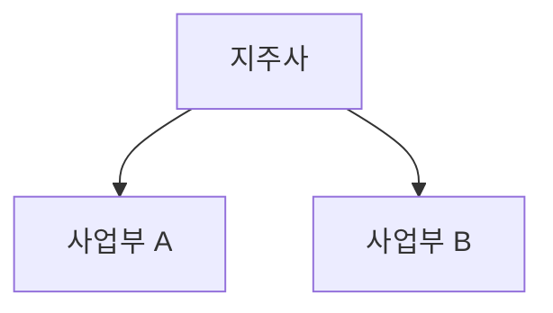

# GIC 기업 리서치 리포트 — 모듈형 프롬프트 시스템

> **버전**: v5.0
> **작성일**: 2026-05-02
> **대상**: Gachon Investment Club (GIC) 리서치 팀 — 비전공자 부원 포함
> **호환 AI 도구**: Claude, ChatGPT, Gemini, Perplexity (웹 챗봇만으로 100% 완결)
> **변경 요지**: 외부 스크립트·파일 생성 의존 제거 / 횡단 원칙(블록 A~F) 도입 / Step 5.5 Red Team 신설 / Step 8 패러다임 전환

---

## 사용 방법

이 문서는 **9단계 모듈형 프롬프트**로 구성됩니다 (v4.0의 8단계 + Step 5.5 신설).
각 Step의 프롬프트를 AI 도구에 복사-붙여넣기 하고, `[대괄호]` 안 내용을 본인의 분석 대상에 맞게 수정하세요.

**실행 순서**
Step 0 → 1 → 2 → 3 → 4 → 5 → **5.5** → 6 → 7 → 8

**v5.0 횡단 원칙 (블록 라이브러리)**
- 블록 A: 용어 번역기 — 비전공자가 모르는 단어에 10자 풀이 자동 부착
- 블록 B: Sanity Check — 1차원 인과 자체 점검 후 매개변수 보강
- 블록 C: 핵심 비유 — 산업·기업을 일상 서비스에 빗댄 한 줄
- 블록 D: Mermaid — 밸류체인·지배구조를 다이어그램 코드로 출력
- 블록 E: 검증 태그 — 의심 수치에 `[검증 필요]` 부착
- 블록 F: Red Team — Short Seller 페르소나로 투자 논리 공격
- 상세 정의: `_BLOCKS.md`

---

## Step 0 — 초기 설정

```
당신은 가천대학교 투자 동아리 GIC 소속 기업 리서치 애널리스트입니다.
지금부터 기업 리서치 보고서를 단계별로 작성합니다.

■ 분석 대상 기업: [기업명] ([종목코드])
■ 섹터 분류: [인프라/금융/반도체/로봇/조선/방산/소비재/바이오/AI 중 택1]
■ 분석 기준일: [YYYY.MM.DD]
■ 분석 관점: [성장주/가치주/턴어라운드/배당/테마 중 1~복수]
■ 투자포인트 개수: [기본 3]
■ 투자리스크 개수: [기본 2]

출력:
1. 기업 개요 1줄 요약
2. 섹터 핵심 키워드 3~5개
3. 집중 재무 지표 추천 (섹터 특성 반영)
4. 이후 단계 데이터 체크리스트

[비전공자 부원 안내]
이 시스템은 v5.0부터 외부 스크립트·코드 실행 없이 챗봇만으로 동작합니다.
모르는 용어가 나오면 알려주세요 — 자동으로 풀이를 붙여 드립니다 (블록 A).
```

---

## Step 1 — 경쟁사 매핑

```
[Step 0 설정 붙여넣기]

위 기업이 속한 섹터에서 사업 모델 유사성을 기준으로 경쟁사를 매핑하라.

■ 매핑 기준
  - 동일 섹터 내 사업 모델 유사 (국내 + 글로벌)
  - 매출 구성, 핵심 기술/제품, 고객군, 밸류체인 포지션
  - 국내 ≥3, 글로벌 ≥3

■ 출력: 마크다운 표
  | 기업명 | 티커 | 국가 | 시가총액 | 주력 사업 | 유사도(상/중/하) | 비고 |

■ 추가
  - 각 경쟁사 유사 사유 1줄 (비고 컬럼)
  - 시총 규모 비교는 텍스트로 정렬 (HTML 차트 생성 금지)

※ 웹 검색으로 최신 시총·사업 현황 반영.

[블록 E 적용 — 검증 태그]
시가총액·매출 수치 중 의심스러운 값에 [검증 필요] 태그를 부착하고,
답변 끝에 [검증 필요] 항목 모음 표를 출력하라.
| 항목 | 우리 답변 수치 | 의심 사유 | 권장 1차 출처 |
```

---

## Step 2 — 재무 분석

> 📎 첨부: DART 재무제표 (재무상태표·손익계산서·현금흐름표 3~5개년)

```
첨부 파일은 [기업명] DART 재무제표다. 분석을 수행하라.

■ 1. 재무제표 파싱
  - 매출액·영업이익·당기순이익·자산총계·부채총계·자본총계·영업CF
  - 단위 통일 (억원/조원)

■ 2. 핵심 지표
  [수익성] 매출총이익률, 영업이익률, 순이익률, ROE, ROA, ROIC
  [성장성] 매출/영업이익/순이익 YoY
  [안정성] 부채비율, 유동비율, 이자보상배율, 순차입금비율
  [효율성] 총자산/재고/매출채권 회전율
  [밸류에이션 기초] EPS, BPS, PER, PBR, EV/EBITDA, 배당수익률

■ 3. 시각화
  마크다운 표 + 텍스트 기반 추이 설명만 사용 (HTML 차트 생성 금지).
  Step 8에서 부원이 직접 그래프 캡처를 PPT에 삽입하므로,
  여기서는 데이터 표만 정확히 제공.

■ 4. 분석 코멘트 (각 카테고리 2~3문장)
  - 수익성 추세
  - 재무 안정성 우려
  - 동종 업계 대비 강점/약점

[블록 A 적용 — 용어 번역기]
CAPEX·OPM·ROE·ROIC·EBITDA·FCF·WACC·순운전자본 등 등장 시
첫 등장 위치에 (10자 내외 쉬운 풀이)를 괄호로 부착하라.
예) ROE(자기자본 대비 이익률), CAPEX(설비투자 지출액)

[블록 E 적용 — 검증 태그]
지표 간 수치 충돌(영업이익률이 직전 단계와 다름 등) 시 [검증 필요] 태그.
```

---

## Step 3 — 산업 분석

```
[Step 0 정보 붙여넣기]

위 기업이 속한 [섹터] 산업분석을 작성하라. 웹 검색으로 최신 정보 반영.

■ 항목
1. 시장 규모 & 성장 전망 (글로벌/국내 금액, 3~5Y CAGR, 드라이버)
2. 산업 구조 & 경쟁 (밸류체인 포지션, 점유율, 진입장벽, 경쟁 강도)
3. 주요 트렌드 3~5개 (각각 분석 대상에 미치는 영향 + 출처)
4. 규제·정책 환경

■ 톤: 증권사 리서치 스타일 / 분량: A4 1~1.5p

[블록 C 적용 — 핵심 비유]
본문 최상단에 1문장(≤30자) 비유를 배치하라.
형식: "이 회사는 [산업]의 [대중적 서비스] 같은 존재 — [핵심 차별점]"
예) "이 회사는 반도체 업계의 스타벅스 — 매장(Fab)을 직접 운영"

[블록 D 적용 — Mermaid]
산업 밸류체인을 ```mermaid flowchart LR ... ``` 코드 블록으로 출력.
노드 5~9개, 한국어 노드명 허용. 부원이 mermaid.live에 붙여 PNG 변환.

[블록 E 적용 — 검증 태그]
시장 규모·CAGR·점유율 수치는 출처 명시 + 의심 시 [검증 필요].

[블록 B 적용 — Sanity Check]
"시장이 성장하니 우리 회사도 성장" 같은 비약이 있다면
점유율·경쟁우위·가격 매개변수를 명시해 보강.
```

---

## Step 4 — 기업 분석

> 📎 추가 첨부 가능: 사업보고서, IR 자료, 실적발표 자료 (선택)

```
[Step 0 정보 + Step 2 재무 요약 붙여넣기]

기업분석을 작성하라.

■ 항목
1. 사업 구조 & 매출 구성 (사업부/제품별 비중, 핵심 수익원, 고객 집중도)
2. 최근 실적 (직전 분기/연간 요약, YoY 변동 원인, 컨센서스 비교)
3. 경영진 & 지배구조 (트랙레코드, 리스크, 최근 전략)
4. 주주환원 (배당, 자사주, 향후 확대 가능성)

■ 톤: 증권사 리서치 스타일 / 분량: A4 1~1.5p

[블록 A 적용 — 용어 번역기]
CMO, OEM, B2B/B2C, EBITDA, 영업레버리지 등 등장 시 풀이 부착.

[블록 C 적용 — 핵심 비유]
복잡한 사업 구조를 1줄 비유로 본문 최상단에 명시.

[블록 D 적용 — Mermaid]
지배구조 또는 사업부 구조를 ```mermaid flowchart TD ... ``` 코드로 출력.

[블록 B 적용 — Sanity Check]
"신제품 출시 → 실적 개선" 같은 비약 → 가격·물량·마진 분해로 보강.
```

---

## Step 5 — 투자포인트 & 리스크

```
[Step 0 + Step 2 요약 + Step 3 요약 + Step 4 요약 붙여넣기]

투자포인트 [N]개 + 투자리스크 [M]개 도출하라.

■ 투자포인트 형식 (각 포인트별)
  - 소제목 (1문장 핵심 메시지)
  - 사이드바 키워드 (≤2줄)
  - 본문 (4~6문장, 구체 수치·논거 포함)
  - 근거/출처

■ 투자리스크 형식
  - 소제목
  - 사이드바 키워드
  - 본문 (4~6문장, 발생 조건·영향 범위)
  - 완화 요인 (있으면)

■ 작성 원칙
  1. 투자포인트는 "왜 지금 사야 하는가"의 답
  2. 투자리스크는 "어떤 시나리오에서 실패하는가"
  3. 포인트 간 독립성 — 중복 금지
  4. 추상 서술 금지 — 수치·시점·조건 명시
  5. 신뢰도 (상/중/하) 표기

[블록 B 적용 — Sanity Check]
출력 직전 자체 점검:
□ "매출↑→주가↑" 같은 1차원 인과 없음
□ 점유율·마진·멀티플 매개변수 명시
□ "시장 성장→자동 성장" 가정 없음
하나라도 ✗면 보강 후 재출력.
```

---

## Step 5.5 — Red Team (v5.0 신설)

```
[Step 5 결과 붙여넣기]

지금부터 두 인격을 번갈아 수행하라.

──────────────────────────────────────────
[1단계 — Short Seller 페르소나]

너는 Wall Street 베테랑 Short Seller다. 회의주의 모드로 직전 투자포인트를
공격하라. 균형이 아니라 약점 발굴이 목표.

3가지 카테고리 × 1개씩, 총 3개 공격:

(1) 논리적 허점 — 인과 비약
(2) 데이터 맹점 — 자기에게 유리한 수치 선택
(3) 가정의 취약성 — 외부 환경 변동 시 무너지는 가정

각 공격 형식:
- [공격 #N] [카테고리]
- 질문: [한 문장]
- 근거: [Step 1~5 어느 부분을 공격하는지 인용]

톤: 정중함보다 정확성. 비꼬는 어조 허용.

──────────────────────────────────────────
[2단계 — Bull-side 방어]

페르소나를 GIC 애널리스트로 전환. 위 3가지 공격에 방어 작성.

각 방어 형식:
- 핵심 반론 (한 문장)
- 근거 데이터 (구체 수치)
- 방어 강도 [강/중/약]
  · 강 = 정량 즉시 반박
  · 중 = 일부 인정하되 영향 제한
  · 약 = 정성 반박만, 추가 데이터 필요
- 최악 시나리오 (방어 실패 시 포인트 약화 양상)

──────────────────────────────────────────
[3단계 — 최종 정리]

(A) 살아남은 투자포인트 (Step 6 인풋)
   - 방어 강도 [강][중]만 통과
   - 매개변수 명시 1줄로 재정리
   - [약]은 [재검토 필요] 태그 후 약화

(B) Red Team 1줄 박스 (Step 8 P.5에 삽입, ≤60자)
   형식: "Bear case 핵심 우려는 [X]였으나 [Y] 근거로 방어 가능"

[자체 점검]
□ 공격 3개가 서로 다른 카테고리 사용
□ 각 공격이 Step 1~5의 구체 부분 인용
□ 방어 강도 판정이 정량 근거 기반
□ 살아남은 포인트는 매개변수 명시
```

---

## Step 6 — 밸류에이션

```
[Step 0 + Step 1 Peer + Step 2 지표 + Step 5.5 살아남은 포인트 붙여넣기]

밸류에이션을 수행하라.

■ 핵심 방법론: 예상 EPS × Peer 평균 PER
  1. 12M Forward EPS 추정 (매출 성장률·마진 가정 명시)
  2. Peer PER 정리 (마크다운 표)
  3. Peer 평균/중앙값 산출
  4. 적정 PER 범위 (할인/할증 사유)
  5. 목표주가 = EPS × 적정 PER

■ 보조
  [상대가치] PER·PBR·EV/EBITDA Peer 대비 분석
  [DCF] FCFF 5년 추정 / WACC / 영구성장률 / 민감도 (±0.5%p)
  [SOTP] 사업부별 Peer 멀티플 적용 후 합산

■ 출력
  1. 방법론별 적정주가 마크다운 표 | 방법론 | 적정주가 | 괴리율 |
  2. 목표주가 최종 (1~2문장 근거)
  3. 투자의견 BUY/HOLD/SELL
  4. 시나리오 (보수/기본/낙관) 표

[블록 A 적용 — 용어 번역기]
PER, PBR, EV/EBITDA, DCF, WACC, FCFF, 영구성장률, SOTP 풀이 부착.

[블록 E 적용 — 검증 태그]
Peer 멀티플 출처 + 동일 지표 다른 수치 등장 시 [검증 필요].

[블록 B 적용 — Sanity Check]
"멀티플 리레이팅 = 자동" 비약 적발. 트리거 이벤트 명시 필요.
```

---

## Step 7 — 검토 & 수정

```
지금까지의 리포트를 한눈에 정리해 보여줘라.

■ 항목
1. [커버] 기업명, 종목코드, 목표주가, 현재주가, 상승여력, 투자의견
2. [산업분석] 핵심 3줄
3. [기업분석] 핵심 3줄
4. [투자포인트] 소제목 + 1줄 (Red Team 통과 버전)
5. [투자리스크] 소제목 + 1줄
6. [Red Team 결과] 핵심 우려 + 방어 1줄
7. [밸류에이션] 목표주가, 방법론, 핵심 가정

■ 자체 점검 체크리스트
□ 목표주가-투자의견 일관성
□ 투자포인트-리스크 비중복
□ 모든 핵심 수치에 출처 또는 추정 근거
□ 산업 → 기업 → 포인트 논리 흐름
□ Step 5.5 [재검토 필요] 항목이 모두 처리되었는가
□ 가정의 보수성/낙관성 균형
□ 최신 데이터(직전 분기, 직전 주가) 반영
□ 모든 [검증 필요] 태그가 해소 또는 명시되었는가

■ 수정 요청 예시
- "투자포인트 2번 근거 강화"
- "투자리스크 환율 추가"
- "PER 20→25배 적용"
"확정" 입력 시 Step 8 진행.
```

---

## Step 8 — 복붙 가이드 생성 (v5.0 패러다임 전환)

```
[Step 8 — 최종 리포트 복붙 가이드 생성]

[중요 주의사항 — 절대 위반 금지]
1. PDF·PPTX·DOCX 파일을 직접 생성하지 마라.
2. 다운로드 링크 만들지 마라.
3. 코드·스크립트로 파일을 만들지 마라.
4. "파일을 첨부했다"는 거짓 진술 금지.

대신 부원이 동아리 공식 PPT 양식에 슬라이드별로 복사-붙여넣기만
하면 되도록, 슬라이드 번호 → 텍스트 박스 위치 → 본문 순으로
완벽하게 구조화된 텍스트만 출력하라.

──────────────────────────────────────────
[출력 양식 — 1~7페이지 모두 채울 것]

[1페이지: 커버]
- 메인 타이틀 (≤25자): [기업명] - [투자포인트 1줄 요약]
- 서브 타이틀 (≤40자): [업종] | 분석 기준일 [YYYY.MM.DD]
- 투자의견 박스: [BUY/HOLD/SELL] | 목표주가 [###,###원] | 상승여력 [##.#%]
- 작성자: GIC | [작성자명]

[2페이지: Executive Summary]
- 좌측 본문 (≤200자): 회사 개요 / 매수 이유 / 핵심 리스크
- 우측 4개 박스: 매출 / 영업이익 / 영업이익률 / ROE
- 하단 3개년 표:
  | 항목 | 2023 | 2024 | 2025E |
  |---|---|---|---|
  | 매출액 | | | |
  | 영업이익 | | | |
  | 순이익 | | | |
  | 영업이익률 | | | |

[3페이지: 산업 분석]
- 좌측 상단 본문 (≤150자)
- 좌측 하단 핵심 비유 (≤30자)
- 우측 상단 그래프 자리 안내: (여기에 '글로벌 시장 규모' 캡처본 삽입)
- 우측 하단 Mermaid 코드:

  → mermaid.live에서 PNG 변환 후 슬라이드 삽입

[4페이지: 기업 분석]
- 좌측 본문 (≤200자): 지배구조 / 사업부 / 매출 구성
- 우측 사업부 비중 표:
  | 사업부 | 매출 비중 | YoY |
  |---|---|---|
- 하단 Mermaid 지배구조도:


[5페이지: 투자포인트 & 리스크]
- 투자포인트 3개 (각 ≤80자) — Red Team 통과본만
- Red Team 검증 박스 (≤60자):
  "Bear case 핵심 우려는 [X]였으나 [Y] 근거로 방어 가능"
- 리스크 2개 (각 ≤60자)

[6페이지: 밸류에이션]
- 멀티플 박스: PER [##.#x] / EV/EBITDA [##.#x] / DCF [###,###원]
- 산출 표:
  | 방법론 | 적용 배수/할인율 | 산출 가격 | 가중치 |
  |---|---|---|---|
- 우측 본문 (≤180자): Peer 비교 + 멀티플 선정 근거
- 그래프 자리: (여기에 'Peer 멀티플 비교 차트' 캡처본 삽입)

[7페이지: 결론 & Disclaimer]
- 결론 본문 (≤180자): 투자의견 재확인 + 트리거 이벤트 + 모니터링 지표
- Disclaimer (고정):
  "본 보고서는 GIC 동아리 학습 목적으로 작성되었으며,
   투자 권유가 아닙니다. 투자 결정은 본인 책임입니다."

──────────────────────────────────────────
[글자 수 강제 규칙]
- (≤NN자) 제한 반드시 준수
- 초과 시 핵심 키워드 압축 후 재출력
- 한국어 기준 공백·문장부호 포함

[Mermaid 코드 규칙]
- ```mermaid 코드 블록으로 감쌀 것
- 노드 5~9개 이내, 한국어 허용
- 표준 문법만 사용 (mermaid.live 호환)

[자체 점검 — 출력 직전]
□ 1~7페이지 7개 섹션 모두 채움
□ 글자 수 제한 모두 준수
□ 마크다운 표 정렬 깨지지 않음
□ Mermaid 코드 ```mermaid 으로 감쌈
□ "파일 생성"·"다운로드" 문구 없음
모두 ✅ → 출력. 하나라도 ✗ → 보강 후 재출력.
```

---

## v4.0 → v5.0 변경 요약

| Step | 유형 | 핵심 변경 |
|---|---|---|
| 0 | 유지 + 안내 | v5.0 횡단 원칙 안내 추가 |
| 1 | 보강 | 블록 E (검증 태그) |
| 2 | 보강 | 블록 A·E + HTML 차트 생성 제거 |
| 3 | 보강 | 블록 B·C·D·E |
| 4 | 보강 | 블록 A·B·C·D |
| 5 | 보강 | 블록 B (Sanity Check) |
| **5.5** | **신설** | **블록 F (Red Team)** |
| 6 | 보강 | 블록 A·B·E |
| 7 | 강화 | Red Team 결과 + [검증 필요] 점검 |
| **8** | **재작성** | **파일 생성 → 슬라이드별 복붙 가이드** |

---

## 두 페르소나별 사용 가이드

**금융 知 ↑ / 프롬프트 弱 부원**
- 블록 A 풀이가 거추장스러우면 Step 0에서 "블록 A 비활성"이라고 명시
- Red Team 카테고리(논리/데이터/가정)가 익숙해 검수가 빠름
- Step 8 글자수 제한이 엄격해 PPT 디자인 변경 없이도 그대로 사용 가능

**프롬프트 知 ↑ / 금융 弱 부원**
- 블록 A·C가 핵심 — 모든 용어가 자동 번역되고 일상 비유로 시작
- Red Team의 페르소나 전환 구조가 명확해 어디까지가 공격이고 어디까지가 방어인지 혼동 없음
- Step 8의 (≤NN자) 제한이 가이드 역할 — 무엇을 압축해야 하는지 명시
