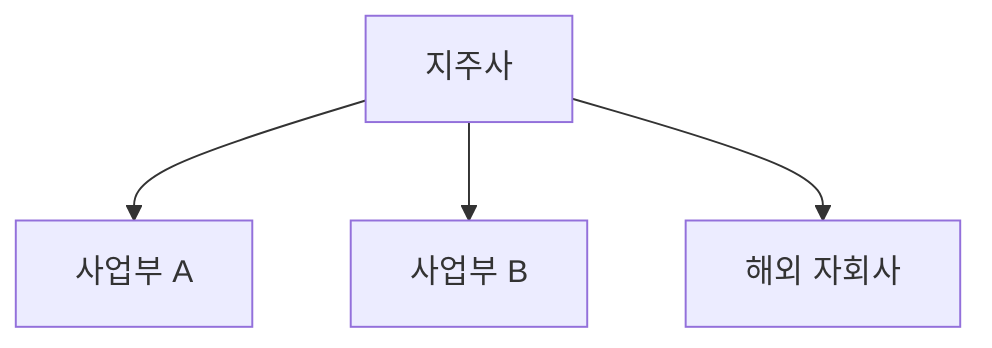

# Step 8 — 복붙 가이드 상세 (v8.0)

> 마스터 시스템의 Step 8을 보완. 슬라이드별 양식·길이 룰·변형 패턴.

---

## 핵심 원칙

1. **AI는 파일을 만들지 않는다** — PPTX·DOCX·PDF 모두 사용자가 손으로 복붙
2. **AI는 슬라이드별로 완벽한 텍스트만 출력**
3. **글자 수 제한 강제** (한국어 기준 공백·문장부호 포함)
4. **그래프는 자리 안내만** ("(여기에 [차트명] 캡처본 삽입)")
5. **Mermaid는 코드 그대로 출력** (mermaid.live에서 PNG 변환)

---

## 표준 7페이지 양식

### 1페이지 — 커버

```
[메인 타이틀] (≤25자)
형식: "[기업명] - [핵심 메시지 1줄]"
예) "삼성전기 - AI MLCC 수혜 본격화"

[서브 타이틀] (≤40자)
형식: "[업종] | 분석 기준일 [YYYY.MM.DD] | GIC 리서치"

[투자의견 박스]
[BUY/HOLD/SELL] | 목표주가 [###,###원] | 상승여력 [+##.#%]
현재주가 [###,###원]
시가총액 [#,###억원]

[작성자] GIC 4기 | [작성자명] | [기준일]
```

### 2페이지 — Executive Summary

```
[좌측 본문] (≤200자)
- 회사 개요 1~2문장
- 매수 이유 핵심 1문장
- 핵심 리스크 1문장
- Red Team 통과 메시지 1문장 (≤60자)

[우측 4개 KPI 박스]
| 매출 ([기간]) | 영업이익 | 영업이익률 | ROE |
| ##.#조원 (+##% YoY) | #,###억원 (+##%) | ##.#% | ##.#% |

[하단 5개년 표 — 2A + 1A + 3E]
| 항목 | FY-2A | FY-1A | FY0E | FY1E | FY2E |
|---|---|---|---|---|---|
| 매출 (조원) | | | | | |
| 영업이익 (억원) | | | | | |
| 순이익 (억원) | | | | | |
| 영업이익률 | | | | | |
| EPS (원) | | | | | |
| PER (배) | | | | | |
| 배당수익률 | | | | | |
```

### 3페이지 — 산업 분석

```
[좌측 상단 본문] (≤150자)
- 시장 규모 + CAGR
- 산업 사이클 위치
- 핵심 트렌드 1개

[좌측 하단 핵심 비유 박스] (≤30자)
"이 회사는 [산업]의 [대중적 서비스] 같은 존재 — [차별점]"

[우측 상단 그래프 자리]
(여기에 '글로벌 [시장명] 시장 규모 추이' 캡처본 삽입)
출처: [출처명, YYYY.MM]

[우측 하단 Mermaid 코드 — 밸류체인]

```

### 4페이지 — 기업 분석

```
[좌측 본문] (≤200자)
- 사업 구조 1문장
- 매출 구성 핵심 1문장
- Moat 핵심 요소 1~2개

[우측 사업부 비중 표]
| 사업부 | 매출 비중 | YoY | 영업이익 기여도 |
|---|---|---|---|

[하단 Mermaid 지배구조도]

```

### 5페이지 — 투자포인트 & 리스크

```
[투자포인트 3개] (각 ≤80자)
Point 1. [소제목] — [핵심 1문장]
Point 2. [소제목] — [핵심 1문장]
Point 3. [소제목] — [핵심 1문장]

[Red Team 검증 박스] (≤60자)
"Bear case 핵심 우려는 [X]였으나 [Y] 근거로 방어 가능"

[리스크 2개] (각 ≤60자)
Risk 1. [소제목] — [발생 조건 1문장]
Risk 2. [소제목] — [발생 조건 1문장]
```

### 6페이지 — 밸류에이션

```
[멀티플 박스]
PER [##.#x] | EV/EBITDA [##.#x] | DCF [###,###원]

[시나리오 매트릭스 표]
| 시나리오 | FY1 EPS | 적용 PER | 목표주가 | 상승여력 |
|---|---|---|---|---|
| Bear | | 피어 하단 | | |
| Base | | 피어 평균 | | |
| Bull | | 피어 상단 | | |

[우측 본문] (≤180자)
- Peer 비교 1~2문장
- 멀티플 선정 근거 1~2문장
- 핵심 가정 1문장

[그래프 자리]
(여기에 'Peer 멀티플 비교 차트' 캡처본 삽입)
출처: [FnGuide / 인베스팅닷컴, YYYY.MM]
```

### 7페이지 — 결론 & Disclaimer

```
[결론 본문] (≤180자)
- 투자의견 재확인 1문장
- 트리거 이벤트 1문장
- 모니터링 지표 1~2개

[Disclaimer — 고정]
"본 보고서는 GIC(Global Investment Club) 동아리 학습 목적으로 작성되었으며,
 투자 권유가 아닙니다. 투자 결정은 본인 책임이며,
 본 자료의 어떠한 손익에 대해서도 책임지지 않습니다."

[참고 출처 모음] (선택)
[1] DART 전자공시시스템 — [기업명] 사업보고서, YYYY.MM
[2] FnGuide Company Guide, YYYY.MM
[3] [증권사명] 리서치센터, "[리포트 제목]", YYYY.MM
[4] [인용 산업 출처], YYYY.MM
```

---

## 글자 수 강제 룰 (한국어 기준)

| 슬라이드 | 항목 | 길이 |
|---|---|---|
| 1 | 메인 타이틀 | ≤25자 |
| 1 | 서브 타이틀 | ≤40자 |
| 2 | 좌측 본문 | ≤200자 |
| 3 | 좌측 상단 본문 | ≤150자 |
| 3 | 핵심 비유 | ≤30자 |
| 4 | 좌측 본문 | ≤200자 |
| 5 | 투자포인트 (각각) | ≤80자 |
| 5 | Red Team 박스 | ≤60자 |
| 5 | 리스크 (각각) | ≤60자 |
| 6 | 우측 본문 | ≤180자 |
| 7 | 결론 본문 | ≤180자 |

> 초과 시 핵심 키워드 압축 후 재출력. 한국어 공백·문장부호 포함.

---

## 양식 변형

### 변형 1: 위클리 투자리포트 (4페이지 압축)

```
[1p] 커버 + 투자의견 (압축)
[2p] 핵심 변동 사유 (이번 주 새 정보 위주)
[3p] 업데이트된 멀티플 / 목표주가
[4p] 모니터링 체크리스트 + Disclaimer
```

→ `위클리_투자리포트_*.md` 참조

### 변형 2: 산업 Top Pick (양식 자유)

```
- 산업 개요 (1~2 슬라이드)
- 산업 내 종목 스크리닝 결과 (표)
- 최선호 종목 1~2개 + 이유 (각 1 슬라이드)
- Risk-Reward 매트릭스 (1 슬라이드)
```

→ `산업_최선호종목_*.md` 참조

---

## Mermaid 코드 작성 규칙

```
flowchart LR  // 가로 흐름 (밸류체인)
flowchart TD  // 세로 흐름 (지배구조)

A[노드 A] --> B[노드 B]   // 화살표 연결
A --> |"라벨"| B           // 라벨 있는 화살표
A -.-> B                   // 점선 (대체재 표시)
```

### 추천 패턴
- **밸류체인**: `원자재 → 부품 → 조립 → 유통 → 고객` (5~6 노드)
- **지배구조**: `지주사 → 사업부 A·B·C → 해외 자회사` (5~9 노드)
- **사업부 매출 흐름**: `MLCC → AI 서버 / 스마트폰 / 자동차` (3 분기 패턴)

### 변환 방법
1. AI 답변에서 ```mermaid 블록 복사
2. mermaid.live 접속 → 좌측 코드 붙여넣기
3. 우측 미리보기 확인
4. 우측 상단 [Actions] → [PNG] 다운로드
5. 슬라이드의 해당 자리에 삽입

---

## 자체 점검 체크리스트 (출력 직전)

□ 1~7페이지 7개 섹션 모두 채움
□ 글자 수 제한 모두 준수 (자동 측정 후 보고)
□ 마크다운 표 정렬 깨지지 않음
□ Mermaid 코드 ```mermaid 으로 감쌈
□ "파일 생성"·"다운로드" 문구 없음
□ 모든 그래프 자리에 출처 명시
□ 투자의견·목표주가·상승여력 일관성
□ 5개년 표 FY 표기 일관성 (A=Actual, E=Estimate)
□ Disclaimer 빠짐없이 포함

모두 ✅ → 출력. 하나라도 ✗ → 보강 후 재출력.

---

## 자주 묻는 질문

**Q: AI가 자꾸 PDF·PPT 파일을 직접 만들려고 한다면?**
A: 마스터 시스템 Step 8 [중요 주의사항] 박스를 다시 강조하라. 그래도 안 되면 "파일 생성 절대 금지. 텍스트만 출력하라"를 명령에 맨 앞에 추가.

**Q: 글자 수 초과 시 어떻게 압축?**
A: 다음 우선순위로 압축
  1. 부사·접속사 제거 ("매우", "그러나" 등)
  2. 수식어 단순화 ("매우 큰 → 큰", "본격적으로 → ")
  3. 명사 압축 ("영업이익률 개선세 → 마진 개선")
  4. 문장 분리 → 한 문장으로 결합 ("A. B." → "A이고 B임")

**Q: 슬라이드 양식이 학회 공식 양식과 안 맞으면?**
A: 위 7페이지는 표준 가이드일 뿐. 학회 양식이 5페이지라면 1·7 합치고 3·4 합치는 식으로 부원 재량 조정. 핵심은 글자 수 룰 + Mermaid + Red Team 박스 유지.
