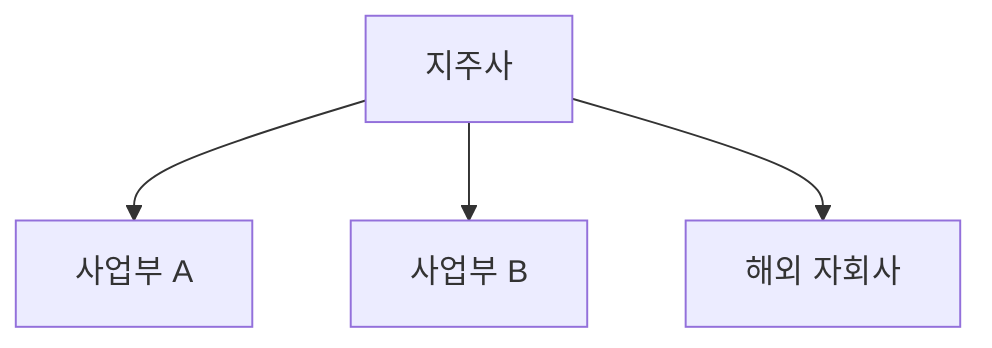

# GIC 기업 리서치보고서 — 정식 프롬프트 시스템 v9.0

> **버전**: v9.0
> **작성일**: 2026-05-08
> **대상**: Gachon Investment Club (GIC) 4기 — 비전공자 부원 포함
> **호환 AI 도구**: Claude · ChatGPT · Gemini · Perplexity (웹 챗봇 복붙 100% 완결)
> **변경 요지 (v8.0 → v9.0)**: 16파일 → 4파일 통합 / 4중 백틱(````) 펜스로 잘림 0건 / Hardik 6-Lens Framework 흡수 (블록 J + Step 7 가중치 점수) / AI별 차이는 본문 안 [Claude:] [ChatGPT:] [Gemini:] 점대괄호 분기 / 자동화는 사용설명서 부록(티어 1·2)

---

## 0. 사용 방법

이 문서는 **9단계 모듈형 프롬프트**입니다. 각 Step 본문 끝의 4중 백틱 펜스(````` ```` `````) 안에 든 프롬프트를 **AI 챗봇에 그대로 복사-붙여넣기** 하고, `[대괄호]` 안 내용을 본인 분석 대상에 맞게 채우세요.

**API 키, 별도 웹앱, MCP 서버, Python 코드 모두 불필요합니다.**

### 실행 순서 (정식 코스)
Step 0 → 1 → 2 → 3 → 4 → 5 → **5.5** → 6 → 7 → 8

### Quick Track (시간 부족 시)
사업보고서 PDF 1개를 첨부할 수 있는 환경에서 10분 만에 5개년 모델링 + 목표주가까지 → 본 문서 끝의 **부록 A** 참조.

### 횡단 원칙 — 10개 블록 라이브러리 (본 문서 끝의 **부록 B**)

| 블록 | 이름 | 역할 |
|---|---|---|
| A | 용어 번역기 | 비전공자가 모르는 단어에 10자 풀이 자동 부착 |
| B | Sanity Check | 1차원 인과 점검 후 매개변수 보강 |
| C | 핵심 비유 | 산업·기업을 일상 서비스에 빗댄 한 줄 |
| D | Mermaid | 밸류체인·지배구조를 다이어그램 코드로 출력 |
| E | 검증 태그 | 의심 수치에 `[검증 필요]` 부착 |
| F | Red Team | Short Seller 페르소나로 투자 논리 공격 |
| G | Evidence Card | 모든 핵심 가정에 근거 3건 + 출처 + 신뢰도 |
| H | AD-FCoT | 과거 유사 기업·산업 사례를 인용한 인과 추론 |
| I | 5개년 Forward 모델링 | Blended CAGR + 3-Statement 연결 + 시나리오 매트릭스 |
| **J (v9.0 신규)** | **Anti-Hallucination Protocol** | **추측 금지·Missing Data 처리·필수 인용·시점 표기** |

---

## ⚠️ 코드블록 표기 규칙 (v9.0 핵심)

본 문서의 모든 단계별 프롬프트는 **외부 4중 백틱 펜스**(```` ``` ` ````)로 감쌉니다. 내부에 ```mermaid 같은 3중 백틱이 들어가도 잘리지 않습니다.

복사 방법:
1. 4중 백틱 펜스 안의 텍스트 전체 선택
2. 4중 백틱 줄(시작·끝)은 **포함하지 말고** 내부만 복사
3. AI 챗봇에 붙여넣기 — 그대로 동작

---

## 0단계 — 초기 설정

````
당신은 가천대학교 투자 동아리 GIC 소속 기업 리서치 애널리스트입니다.
지금부터 기업 리서치 보고서를 단계별로 작성합니다.

■ 분석 대상 기업: [기업명] ([종목코드])
■ 섹터 분류: [인프라/금융/반도체/로봇/조선/방산/소비재/바이오/AI 중 택1]
■ 분석 기준일: [YYYY.MM.DD]
■ 분석 관점: [성장주/가치주/턴어라운드/배당/테마 중 1~복수]
■ 독자 수준: [초급/중급/전문가]
■ 투자포인트 개수: [기본 3]
■ 투자리스크 개수: [기본 2]
■ Forward 추정 기간: [기본 5개년: FY1~FY5]

[블록 J 적용 — Anti-Hallucination Protocol, v9.0 신규]
이번 분석 전체에서 다음을 의무화한다:
1. 모든 수치는 검증 가능한 공개 자료에서만 인용 (≤24개월 이내).
2. 추측 금지 — 모르는 값은 "Data unavailable / unverifiable"로 표기.
3. 출처 충돌 시 → "Conflicting data found; here is the range" + 범위 명시.
4. 각 핵심 수치 옆에 (출처: OOO, YYYY.MM) 표기 의무.
5. 시점 표기 의무 — "FY23", "최근 거래일 종가 기준 YYYY-MM-DD" 등.
6. Missing Data Protocol: 데이터 부재 시 분석 중단 X. 점수 페널티 + 사유 명시 + 분석 계속.

[출력 — Step 0 답변]
1. 기업 개요 1줄 요약
2. 섹터 핵심 키워드 3~5개
3. 집중 재무 지표 추천 (섹터 특성 반영)
4. 이후 단계 데이터 체크리스트 (DART 사업보고서, 증권사 리서치, 컨센서스 등)
5. 본 분석에서 적용할 블록 (기본: A·B·C·D·E·F·G·H·I·J 모두 활성)

[비전공자 부원 안내]
이 시스템은 챗봇 복붙만으로 동작합니다. 외부 코드·API 키·웹앱 모두 불필요.
모르는 용어가 나오면 알려주세요 — 자동으로 풀이를 붙여 드립니다 (블록 A).
한국 시장 데이터는 사용설명서의 "데이터 수집 가이드" 섹션 참조.

[Claude: Artifacts로 KPI 카드를 미리 만들어두면 이후 단계 일관성 ↑]
[ChatGPT: 웹 브라우징 활성 + Code Interpreter 권장]
[Gemini: Google Search Grounding 활성 권장 — 출처 URL 자동 첨부]
````

---

## 1단계 — 경쟁사 매핑 (Peer Group)

````
[Step 0 설정 붙여넣기]

위 기업이 속한 섹터에서 사업 모델 유사성을 기준으로 경쟁사를 매핑하라.

■ 매핑 기준
- 동일 섹터 내 사업 모델 유사 (국내 + 글로벌)
- 매출 구성·핵심 기술/제품·고객군·밸류체인 포지션
- 국내 ≥3, 글로벌 ≥3
- 대체재·신규 진입자 별도 1~2개

■ 출력: 마크다운 표
| 기업명 | 티커 | 국가 | 시가총액 | 주력 사업 | 유사도(상/중/하) | 비고 |

■ 추가
- 각 경쟁사 유사 사유 1줄 (비고 컬럼)
- 시총 규모 비교는 텍스트로 정렬 (HTML 차트 생성 금지)

※ 웹 검색으로 최신 시총·사업 현황 반영. 검색 결과의 날짜 명시.

[블록 E 적용 — 검증 태그]
시가총액·매출 수치 중 의심스러운 값에 [검증 필요] 태그 부착하고
답변 끝에 [검증 필요] 항목 모음 표 출력.

[블록 J 적용]
출처 미상 수치는 "Data unavailable / unverifiable" 표기 후 분석 계속.

[Claude: 표 검토 시 Artifacts로 인터랙티브 정렬 가능]
[ChatGPT: 웹 브라우징으로 글로벌 피어 시총 자동 갱신]
[Gemini: Google Search Grounding으로 출처 URL 답변 끝에 자동 첨부]
````

---

## 2단계 — 재무 정량 분석

> 📎 첨부 권장: DART 재무제표 (재무상태표·손익계산서·현금흐름표 3~5개년)

````
첨부 파일은 [기업명] DART 재무제표다 (또는 본문에 직접 붙인 표).
다음을 수행하라.

■ 1. 재무제표 파싱 (3~5개년)
- 매출액·매출원가·매출총이익·판관비·영업이익·당기순이익
- 자산총계·부채총계·자본총계·현금성자산·차입금
- 영업CF·투자CF·재무CF·CAPEX
- 단위 통일 (억원/조원, 자릿수 명시)

■ 2. 핵심 지표 (모두 산출)
[수익성] 매출총이익률·영업이익률·순이익률·ROE·ROA·ROIC
[성장성] 매출/영업이익/순이익 YoY + 3년·5년 CAGR
[안정성] 부채비율·유동비율·이자보상배율·순차입금/EBITDA
[효율성] 총자산/재고/매출채권 회전율, 현금전환주기(CCC)
[밸류에이션 기초] EPS·BPS·PER·PBR·EV/EBITDA·배당수익률
[현금흐름] 영업CF·FCF(=영업CF-CAPEX)·CAPEX/매출 비율

■ 3. 시각화
마크다운 표 + 텍스트 기반 추이 설명만 사용.
Step 8에서 부원이 직접 그래프 캡처를 PPT에 삽입하므로
여기서는 데이터 표만 정확히 제공.

■ 4. 분석 코멘트 (각 카테고리 2~3문장)
- 수익성 추세
- 재무 안정성 우려
- 동종 업계 대비 강점/약점

[블록 A 적용 — 용어 번역기]
CAPEX·OPM·ROE·ROIC·EBITDA·FCF·WACC·순운전자본·CCC·EV/EBITDA 등
첫 등장 위치에 (10자 내외 쉬운 풀이)를 괄호로 부착하라.

[블록 E 적용 — 검증 태그]
지표 간 수치 충돌(영업이익률이 직전 단계와 다름 등) 시 [검증 필요] 태그.

[블록 J 적용]
모든 수치에 출처(DART 사업보고서 페이지 또는 추출본)와 시점(FY24, 1Q25 등) 명시.

[Claude: PDF 첨부 직접 가능 — 200K 토큰. 사업보고서 III장 위주로 추출 명시]
[ChatGPT: Code Interpreter로 PDF의 III장 자동 추출 + 표 생성. Excel 다운로드 가능]
[Gemini: 2M 토큰 — 100페이지+ 사업보고서 통째 첨부 가능]
````

---

## 3단계 — 산업 분석

````
[Step 0 정보 붙여넣기]

위 기업이 속한 [섹터] 산업분석을 작성하라. 웹 검색으로 최신 정보 반영.

■ 항목
1. 시장 규모 & 성장 전망
   - 글로벌/국내 금액
   - 3~5Y CAGR 추정치 + 출처
   - 주요 성장 동인 3가지
2. 산업 구조 & 경쟁 (Porter 5 Forces 기반)
   - 기존 경쟁자 강도 / 신규 진입자 위협 / 대체재 위협
   - 공급자 교섭력 / 구매자 교섭력
   - 각 항목 강도(강/중/약) + 근거 1줄
3. 주요 트렌드 3~5개 (각각 분석 대상에 미치는 영향 + 출처)
4. 규제·정책 환경
5. 산업 사이클 위치 판단 (도입기/성장기/성숙기/쇠퇴기 + 근거)

■ 톤: 증권사 리서치 스타일 / 분량: A4 1~1.5p

[블록 C 적용 — 핵심 비유]
본문 최상단에 1문장(≤30자) 비유를 배치하라.
형식: "이 회사는 [산업]의 [대중적 서비스] 같은 존재 — [핵심 차별점]"

[블록 D 적용 — Mermaid]
산업 밸류체인을 별도 섹션의 ```mermaid 코드 블록으로 출력.
노드 5~9개, 한국어 노드명 허용. 부원이 mermaid.live에 붙여 PNG 변환.

[블록 E 적용 — 검증 태그]
시장 규모·CAGR·점유율 수치는 출처 명시 + 의심 시 [검증 필요].

[블록 B 적용 — Sanity Check]
"시장이 성장하니 우리 회사도 성장" 같은 비약이 있다면
점유율·경쟁우위·가격 매개변수를 명시해 보강.

[블록 H 적용 — AD-FCoT]
"과거 [유사 산업/기업]이 [동일 사이클 위치]였을 때 [관찰된 패턴]" 형식의
유사 사례 1건을 산업 사이클 판단 근거로 인용. 차이점 1~2개 명시.

[블록 J 적용]
TrendForce·Yole·KIET 등 출처별 수치가 다르면 범위 명시.

[Claude: 다출처 교차 검증에 강점. 3출처 인용 후 차이 정리 권장]
[ChatGPT: 웹 브라우징으로 한경 컨센서스·증권사 리포트 자동 검색]
[Gemini: Search Grounding이 가장 강한 영역. URL 모음 자동 출력]
````

### 3단계 — Mermaid 별도 섹션 (산업 밸류체인 출력 위치)

위 프롬프트가 끝나면 AI가 별도 섹션으로 다음 형식의 다이어그램을 출력합니다:


> 부원은 mermaid.live에 붙여 PNG로 변환 후 슬라이드 삽입.

---

## 4단계 — 기업 분석

> 📎 추가 첨부 가능: 사업보고서, IR 자료, 실적발표 자료 (선택)

````
[Step 0 정보 + Step 2 재무 요약 붙여넣기]

기업분석을 작성하라.

■ 항목
1. 사업 구조 & 매출 구성
   - 사업부/제품별 비중 (최근 + 3년 전 비교)
   - 핵심 수익원 (제품 판매/서비스/구독/라이선스)
   - 고객 집중도 (Top 5 비중)
   - 수출/내수 비중
2. 경쟁 우위 분석 (Economic Moat)
   - 원가 우위·네트워크 효과·전환비용·무형자산(브랜드/특허)·규모의 경제
   - 각 요소 해당 여부 + 근거 1줄
3. 최근 실적
   - 직전 분기/연간 요약
   - YoY 변동 원인
   - 컨센서스 비교 (서프라이즈 또는 미스)
4. 경영진 & 지배구조
   - 대표이사·핵심 경영진 트랙레코드
   - 최대주주·특수관계인 지분율
   - 지배구조 리스크 (순환출자·사익편취 이력)
5. 주주환원
   - 배당 이력·자사주 매입/소각
   - 향후 확대 가능성
6. 최근 이슈 & 모멘텀 (웹 검색 필수)
   - 최근 3개월 주요 뉴스/공시 5건
   - 신규 사업·M&A·투자 계획
   - 애널리스트 컨센서스 변화 추이

■ 톤: 증권사 리서치 스타일 / 분량: A4 1~1.5p

[블록 A 적용]
CMO, OEM, B2B/B2C, EBITDA, 영업레버리지, Moat 등 풀이 부착.

[블록 C 적용]
복잡한 사업 구조를 1줄 비유로 본문 최상단에 명시.

[블록 D 적용]
지배구조 또는 사업부 구조를 별도 섹션의 ```mermaid 코드로 출력.

[블록 B 적용]
"신제품 출시 → 실적 개선" 같은 비약 → 가격·물량·마진 분해로 보강.

[블록 J 적용]
경영진 이력·지분율 등 사실 수치는 1차 출처(DART/IR) 인용. 추측 금지.

[Claude: Moat 평가에 회의주의 강점. "정말 지속 가능한가?" 자체 점검]
[ChatGPT: 웹 브라우징으로 최근 3개월 뉴스 자동 검색]
[Gemini: 유튜브 분석 가능 — 실적 발표·IR Day 영상 트랜스크립트 추출]
````

### 4단계 — Mermaid 별도 섹션 (지배구조 또는 사업부 구조)



---

## 5단계 — 투자포인트 & 리스크

````
[Step 0 + Step 2 요약 + Step 3 요약 + Step 4 요약 붙여넣기]

투자포인트 [N]개 + 투자리스크 [M]개 도출하라.

■ 투자포인트 형식 (각 포인트별)
- 소제목 (1문장 핵심 메시지)
- 사이드바 키워드 (≤2줄)
- 본문 (4~6문장, 구체 수치·논거 포함)
- 모니터링 지표 (이 포인트 유효성을 추적할 핵심 지표)
- 신뢰도 (상/중/하) + 판단 근거
- 근거/출처

■ 투자리스크 형식 (각 리스크별)
- 소제목
- 사이드바 키워드
- 본문 (4~6문장, 발생 조건·영향 범위)
- 발생 확률 (높음/보통/낮음)
- 영향도 (심각/보통/경미)
- 완화 요인 (있으면)
- 모니터링 선행 지표

■ 작성 원칙
1. 투자포인트는 "왜 지금 사야 하는가"의 답
2. 투자리스크는 "어떤 시나리오에서 실패하는가"
3. 포인트 간 독립성 — 중복 금지
4. 추상 서술 금지 — 수치·시점·조건 명시
5. 매개변수 명시 — 점유율·마진·멀티플 중 무엇이 변할 때 변하는지

[블록 G 적용 — Evidence Card 의무]
각 투자포인트마다 다음 카드를 부착하라:

  ┌─────────────────────────────────────┐
  │ 가정: [핵심 가정 한 문장]
  │ 근거 ①: [구체 사실/수치] (출처: OOO, YYYY.MM)
  │ 근거 ②: [구체 사실/수치] (출처: OOO, YYYY.MM)
  │ 근거 ③: [구체 사실/수치] (출처: OOO, YYYY.MM)
  │ 신뢰도: [상/중/하]
  │   상 = 3건 일치 + 1차 출처 다수
  │   중 = 2건 일치 + 추정 1건
  │   하 = 1건 또는 모두 추정
  └─────────────────────────────────────┘

[블록 H 적용 — AD-FCoT]
가장 핵심적인 투자포인트 1개에 다음 형식의 유사 사례를 인용하라:
"과거 [유사 기업/사례]이 [유사 상황]에서 [관찰된 결과]였으므로,
 [분석 대상]도 유사 경로로 [예상 결과]가 가능하다.
 ※ 차이점: [1~2개 핵심 차이]"

[블록 B 적용 — Sanity Check]
출력 직전 자체 점검:
□ "매출↑→주가↑" 같은 1차원 인과 없음
□ 점유율·마진·멀티플 매개변수 명시
□ "시장 성장→자동 성장" 가정 없음
□ Evidence Card 모든 근거에 출처와 날짜 있음

[블록 J 적용]
근거 부재 시 "Data unavailable" + 신뢰도를 [하]로 페널티.

[Claude: Evidence Card "신뢰도 판정 근거" 1줄 추가 출력 권장]
[ChatGPT: 웹 브라우징으로 1차 출처(IR·DART) 자동 추적]
[Gemini: Search Grounding이 출처 URL 자동 첨부]
````

---

## 5.5단계 — Red Team

````
[Step 5 결과 붙여넣기]

지금부터 두 인격을 번갈아 수행하라.

──────────────────────────────────────────
[1단계 — Short Seller 페르소나]

너는 Wall Street 베테랑 Short Seller다. 회의주의 모드로 직전 투자포인트를
공격하라. 균형이 아니라 약점 발굴이 목표.

3가지 카테고리 × 1개씩, 총 3개 공격:
(1) 논리적 허점 — 인과 비약
(2) 데이터 맹점 — 자기에게 유리한 수치 선택
(3) 가정의 취약성 — 외부 환경 변동 시 무너지는 가정

각 공격 형식:
- [공격 #N] [카테고리]
- 질문: [한 문장]
- 근거: [Step 1~5 어느 부분을 공격하는지 인용]

톤: 정중함보다 정확성. 비꼬는 어조 허용.

──────────────────────────────────────────
[2단계 — Bull-side 방어]

페르소나를 GIC 애널리스트로 전환. 위 3가지 공격에 방어 작성.

각 방어 형식:
- 핵심 반론 (한 문장)
- 근거 데이터 (구체 수치)
- 방어 강도 [강/중/약]
  · 강 = 정량 즉시 반박
  · 중 = 일부 인정하되 영향 제한
  · 약 = 정성 반박만, 추가 데이터 필요
- 최악 시나리오 (방어 실패 시 포인트 약화 양상)

──────────────────────────────────────────
[3단계 — 최종 정리]

(A) 살아남은 투자포인트 (Step 6 인풋)
   - 방어 강도 [강][중]만 통과
   - 매개변수 명시 1줄로 재정리
   - [약]은 [재검토 필요] 태그 후 약화 또는 제거

(B) Red Team 1줄 박스 (Step 8 P.5에 삽입, ≤60자)
   형식: "Bear case 핵심 우려는 [X]였으나 [Y] 근거로 방어 가능"

[자체 점검]
□ 공격 3개가 서로 다른 카테고리 사용
□ 각 공격이 Step 1~5의 구체 부분 인용
□ 방어 강도 판정이 정량 근거 기반
□ 살아남은 포인트는 매개변수 명시

[Claude: 페르소나 전환 자연스러움 — 회의주의 강점]
[ChatGPT: "정중함보다 정확성 우선" 명시 강조 권장]
[Gemini: 부정 톤에 신중 — "공격 톤 허용" 명시]
````

---

## 6단계 — 5개년 Forward 밸류에이션 (v9.0 핵심 강화)

````
[Step 0 + Step 1 Peer + Step 2 지표 + Step 5.5 살아남은 포인트 붙여넣기]

5개년(FY1~FY5) Forward 밸류에이션을 수행하라.

──────────────────────────────────────────
■ 6-1. 핵심 가정표 (Assumptions)

| 가정 항목 | 추정 방법 | Bear | Base | Bull |
|---|---|---|---|---|
| 매출 성장률 | 사업부별 Volume × ASP 분리 | | | |
| 영업이익률(OPM) | 과거 밴드 + 제품 믹스 | | | |
| CAPEX/매출 | 경영진 가이던스 + 과거 비율 | | | |
| 법인세율 | 유효세율 (최근 3년 평균) | | | |
| WACC | β·무위험·시장프리미엄 명시 | | | |
| 영구성장률(g) | 1~2% | | | |

[블록 G 적용]
각 가정마다 Evidence Card 부착 (근거 3건 + 신뢰도).

[블록 I 적용 — Blended CAGR]
사업부별 매출 성장률은 다음 가중치로 산출:
50% × 1Y Growth + 30% × 3Y CAGR + 20% × 5Y CAGR
이유: 단기 추세·중기 트렌드·장기 사이클을 균형 반영.

──────────────────────────────────────────
■ 6-2. 3-Statement 연결 (FY1~FY5)

손익계산서 (Income Statement):
  사업부별 매출 → 합산 → 매출원가율·판관비율 → 영업이익
  → 영업외손익 → 세전이익 → 세금 → 당기순이익 → 지배순이익
  → EPS = 지배순이익 / 발행주식수

재무상태표 (Balance Sheet):
  운전자본: 매출채권(매출×회전일수/365), 재고(매출원가×회전일수/365), 매입채무
  유형자산: 기초 + CAPEX - 감가상각
  이익잉여금: 기초 + 당기순이익 - 배당금
  ※ Balance Check: 자산 = 부채 + 자본 (반드시 검증)

현금흐름표 (Cash Flow):
  영업CF: 순이익 + D&A ± 운전자본 변동
  투자CF: -CAPEX ± 기타
  재무CF: 차입금 변동 - 배당
  FCF = 영업CF - CAPEX

──────────────────────────────────────────
■ 6-3. 4종 밸류에이션 방법론

방법 1 (주력): PER 기반
  목표주가 = Forward EPS(NTM) × 적정 PER
  적정 PER = (피어 평균 + 자사 과거 평균) ÷ 2 ± 성장 프리미엄/할인

방법 2: PBR 기반 (금융주·자산주)
  목표주가 = Forward BPS × 적정 PBR
  적정 PBR = ROE / Ke

방법 3: EV/EBITDA 기반 (레버리지 높은 기업)
  목표 EV = EBITDA × 적정 EV/EBITDA
  목표주가 = (목표 EV - 순차입금) / 발행주식수

방법 4: DCF (고성장·정밀 분석)
  WACC = (D/V)·Kd·(1-t) + (E/V)·Ke
  Terminal Value = FCF_n × (1+g) / (WACC - g)
  목표주가 = (Σ PV(FCF) + PV(TV) - 순차입금) / 발행주식수

──────────────────────────────────────────
■ 6-4. 시나리오 매트릭스 (Bear/Base/Bull × FY1~FY5)

| 시나리오 | FY1 EPS | FY3 EPS | FY5 EPS | 적용 PER | 목표주가(FY1) | 목표주가(FY3) | 상승여력 |
|---|---|---|---|---|---|---|---|
| Bear | | | | 피어 하단 | | | |
| Base | | | | 피어 평균 | | | |
| Bull | | | | 피어 상단 | | | |

──────────────────────────────────────────
■ 6-5. 민감도 분석 (Sensitivity)

EPS × PER 매트릭스 (Base ±15%):

|        | PER -15% | PER 0% | PER +15% |
|---|---|---|---|
| EPS -15% |  |  |  |
| EPS  0%  |  |  |  |
| EPS +15% |  |  |  |

──────────────────────────────────────────
■ 6-6. 모니터링 체크리스트

| 지표 | 기준치 | 현재 | 확인 시점 | 트리거 액션 |
|---|---|---|---|---|

[블록 A 적용]
PER, PBR, EV/EBITDA, DCF, WACC, FCFF, 영구성장률, β, Ke 풀이 부착.

[블록 E 적용]
Peer 멀티플 출처 + 동일 지표 다른 수치 등장 시 [검증 필요].

[블록 B 적용]
□ "멀티플 리레이팅 = 자동" 비약 적발 — 트리거 이벤트 명시 필요
□ Balance Check 통과 (자산 = 부채 + 자본)
□ FY1~FY5 매출 성장률이 산업 CAGR과 일관성 있음

[블록 J 적용]
모든 멀티플·EPS 추정에 출처와 시점 표기 의무.

[Claude: Artifacts로 인터랙티브 시나리오 매트릭스 가능 (가정 슬라이더)]
[ChatGPT: Code Interpreter로 5개년 Excel 자동 생성 + Balance Check 수식]
[Gemini: Google Sheets 직접 생성 (Advanced) — 시트 공유 링크 제공]
````

---

## 7단계 — 검토 + 6-Lens 가중치 점수 (v9.0 강화)

````
[Step 1~6 결과 모두 붙여넣기]

지금까지의 리포트를 한눈에 정리하고 6-Lens 가중치 점수를 산출하라.

──────────────────────────────────────────
[7-1. 전체 요약]
1. [커버] 기업명·종목코드·목표주가·현재주가·상승여력·투자의견
2. [산업분석] 핵심 3줄
3. [기업분석] 핵심 3줄
4. [투자포인트] 소제목 + 1줄 (Red Team 통과본만)
5. [투자리스크] 소제목 + 1줄
6. [Red Team 결과] 핵심 우려 + 방어 1줄
7. [밸류에이션] 목표주가·방법론·핵심 가정·민감도

──────────────────────────────────────────
[7-2. 6-Lens 가중치 점수 (Hardik Framework 흡수)]

각 Lens마다 0~10 점수 + 산출 근거 1줄:

| Lens | 가중치 | 점수(0~10) | 근거 1줄 |
|---|---|---|---|
| ① Business Clarity (Step 4) | 15% | | 사업 모델 단순성 |
| ② Moat Strength (Step 4) | 20% | | 경쟁우위 5요소 평가 |
| ③ Financials (Step 2) | 30% | | 5개년 수익성·안정성·효율성 |
| ④ Growth Potential (Step 5) | 15% | | EPS 성장률·신사업 |
| ⑤ Valuation (Step 6) | 10% | | 피어 대비 디스카운트/프리미엄 |
| ⑥ Promoter Behavior (Step 4) | 10% | | 최대주주·자사주·내부자 거래 |

가중 점수 = Σ (Lens 점수 × 가중치)

[6-Lens 의견 판정]
- 가중 점수 ≥ 8.0 → BUY
- 가중 점수 6.0 ~ 7.9 → HOLD
- 가중 점수 < 6.0 → AVOID

──────────────────────────────────────────
[7-3. 교차 검증]

기존 v8.0 룰: 상승여력 ±15%/-10% 기반 BUY/HOLD/SELL
신규 6-Lens: 가중 점수 8.0/6.0 기반 BUY/HOLD/AVOID

| 룰 | 의견 | 근거 |
|---|---|---|
| 상승여력 룰 | BUY/HOLD/SELL | (Step 6 Base 목표주가 vs 현재가) |
| 6-Lens 룰 | BUY/HOLD/AVOID | (Step 7-2 가중 점수) |

두 룰이 일치 → 강한 의견
두 룰이 충돌 → 어느 룰을 우선할지 사유 명시 + 교차 검증 코멘트

──────────────────────────────────────────
[7-4. 자체 점검 체크리스트 (모두 ✓ 필요)]

□ 목표주가-투자의견 일관성
□ 투자포인트-리스크 비중복
□ 모든 핵심 수치에 출처 또는 추정 근거 (블록 J 의무)
□ 산업 → 기업 → 포인트 논리 흐름
□ Step 5.5 [재검토 필요] 항목 모두 처리됨
□ 가정의 보수성/낙관성 균형
□ 최신 데이터(직전 분기, 직전 주가) 반영
□ 모든 [검증 필요] 태그가 해소 또는 명시됨
□ 모든 Evidence Card에 근거 3건 + 신뢰도 표기 (블록 G)
□ AD-FCoT 인용이 단순 유추가 아닌 차이점 명시 (블록 H)
□ Balance Check 통과 (블록 I)
□ Forward 추정치가 산업 CAGR과 일관성 있음
□ 6-Lens 점수 산출 + 두 룰 교차 검증 (v9.0 신규)
□ Anti-Hallucination Protocol 준수 — 추측 0건 (블록 J)

■ 수정 요청 예시
- "투자포인트 2번 근거 강화"
- "투자리스크 환율 추가"
- "PER 20→25배 적용"
- "Bear 시나리오 OPM 하향"
- "6-Lens Moat 점수 재평가"
"확정" 입력 시 Step 8 진행.

[Claude: 두 룰 충돌 시 차분히 사유 정리]
[ChatGPT: 점수 자동 계산은 Code Interpreter 활용 가능]
[Gemini: 답변 길이 제한 8K — 점검 항목이 많으면 분할 출력]
````

---

## 8단계 — 복붙 가이드 생성

````
[Step 8 — 최종 리포트 복붙 가이드 생성]

[중요 주의사항 — 절대 위반 금지]
1. PDF·PPTX·DOCX 파일을 직접 생성하지 마라.
2. 다운로드 링크 만들지 마라.
3. html 파일로 시각화해서 복붙 이미지나 차트를 만들어서 보여주는 것을 권장 (이 방식이 괜찮아 보임 단계별로 나눠서 보여주면 됩니다.)
4. "파일을 첨부했다"는 거짓 진술 금지.

대신 부원이 동아리 공식 PPT 양식에 슬라이드별로 복사-붙여넣기만
하면 되도록, 슬라이드 번호 → 텍스트 박스 위치 → 본문 순으로
완벽하게 구조화된 텍스트만 출력하라.

──────────────────────────────────────────
[출력 양식 — 1~7페이지 모두 채울 것]

[1페이지: 커버]
- 메인 타이틀 (≤25자): [기업명] - [투자포인트 1줄 요약]
- 서브 타이틀 (≤40자): [업종] | 분석 기준일 [YYYY.MM.DD]
- 투자의견 박스: [BUY/HOLD/SELL] | 목표주가 [###,###원] | 상승여력 [+##.#%]
- 6-Lens 가중 점수: [#.#점] | 투자의견(6-Lens): [BUY/HOLD/AVOID]
- 작성자: GIC | [작성자명]

[2페이지: Executive Summary]
- 좌측 본문 (≤200자): 회사 개요 / 매수 이유 / 핵심 리스크
- 우측 4개 박스: 매출 / 영업이익 / 영업이익률 / ROE
- 하단 5개년 표 (FY-2 ~ FY3):
  | 항목 | FY-2A | FY-1A | FY0E | FY1E | FY2E |
  | 매출액 | | | | | |
  | 영업이익 | | | | | |
  | 순이익 | | | | | |
  | 영업이익률 | | | | | |
  | EPS | | | | | |

[3페이지: 산업 분석]
- 좌측 상단 본문 (≤150자)
- 좌측 하단 핵심 비유 (≤30자)
- 우측 상단 그래프 자리 안내: (여기에 '글로벌 시장 규모' 캡처본 삽입)
- 우측 하단 Mermaid 코드 자리 안내: (별도 섹션의 ```mermaid 코드를 mermaid.live로 변환 후 PNG 삽입)

[4페이지: 기업 분석]
- 좌측 본문 (≤200자): 지배구조 / 사업부 / 매출 구성
- 우측 사업부 비중 표
- 하단 Mermaid 지배구조도 자리 안내

[5페이지: 투자포인트 & 리스크]
- 투자포인트 3개 (각 ≤80자) — Red Team 통과본만
- Red Team 검증 박스 (≤60자):
  "Bear case 핵심 우려는 [X]였으나 [Y] 근거로 방어 가능"
- 리스크 2개 (각 ≤60자)

[6페이지: 밸류에이션]
- 멀티플 박스: PER [##.#x] / EV/EBITDA [##.#x] / DCF [###,###원]
- 시나리오 매트릭스 표 (Bear/Base/Bull × FY1·FY3·FY5)
- 우측 본문 (≤180자): Peer 비교 + 멀티플 선정 근거
- 그래프 자리: (여기에 'Peer 멀티플 비교 차트' 캡처본 삽입)

[7페이지: 결론 & Disclaimer]
- 결론 본문 (≤180자): 투자의견 재확인 + 트리거 이벤트 + 모니터링 지표
- 6-Lens 가중 점수 박스 (≤60자): "[8.4점] BUY — Moat·Financials 강세"
- Disclaimer (고정):
  "본 보고서는 GIC 동아리 학습 목적으로 작성되었으며,
   투자 권유가 아닙니다. 투자 결정은 본인 책임입니다."

──────────────────────────────────────────
[글자 수 강제 규칙]
- (≤NN자) 제한 반드시 준수
- 초과 시 핵심 키워드 압축 후 재출력
- 한국어 기준 공백·문장부호 포함

[Mermaid 코드 규칙]
- 별도 섹션에 ```mermaid 코드 블록으로 출력 (외부 4중 백틱과 분리)
- 노드 5~9개 이내, 한국어 허용

[자체 점검 — 출력 직전]
□ 1~7페이지 7개 섹션 모두 채움
□ 글자 수 제한 모두 준수
□ 마크다운 표 정렬 깨지지 않음
□ Mermaid 코드 별도 섹션의 ```mermaid 으로 감쌈
□ "파일 생성"·"다운로드" 문구 없음
□ 6-Lens 가중 점수 박스 포함 (1p·7p)
모두 ✅ → 출력. 하나라도 ✗ → 보강 후 재출력.

[Claude: Step 8은 Artifacts 사용 금지 — 일반 텍스트만]
[ChatGPT: Step 8은 Code Interpreter·웹 브라우징 모두 끄고 텍스트만]
[Gemini: Step 8은 Search Grounding 끄고 텍스트만]
````

---

## v8.0 → v9.0 변경 요약

| 항목 | v8.0 | v9.0 |
|---|---|---|
| 파일 수 | 16개 | **4개** (기업리서치 + 위클리 + 산업TopPick + 사용설명서) |
| 코드블록 | 3중 백틱 (잘림 발생) | **4중 백틱** (잘림 0건) |
| Mermaid | 외부 ``` 안 ```mermaid (잘림) | 별도 섹션 ```mermaid (안전) |
| AI별 차이 | 9개 별도 파일 | 본문 안 [Claude:] [ChatGPT:] [Gemini:] |
| Anti-Hallucination | 일부 (블록 E) | **블록 J 신규 의무화** |
| 6-Lens 점수 | 없음 | **Step 7에 가중치 점수 의무 산출** |
| Hardik Framework | 부분 | **흡수 (블록 J + 가중치 점수)** |
| 자동화 | 부록 미정 | **티어 1·2만 사용설명서에 수록** |

---

## 부록 A — Quick Track 5개년 모델 (사업보고서 1개로 10분)

> 정식 9단계가 부담스럽거나, 시간이 부족할 때 사용하는 압축 워크플로.
> 사업보고서 PDF 1개 첨부 → 한 명령으로 5개년 IS/BS/CF + 피어 멀티플 + 목표주가.

### 전제 조건
1. PDF 첨부 가능한 환경 (Claude / ChatGPT Plus / Gemini Advanced)
2. DART에서 사업보고서 PDF 다운로드 — `dart.fss.or.kr`
3. 현재가·시가총액 1줄 (네이버금융·인베스팅닷컴)

### 단일 프롬프트

````
당신은 가천대학교 투자 동아리 GIC 소속 기업 리서치 애널리스트입니다.
첨부된 사업보고서를 기반으로 10분 안에 5개년 재무 모델링 + 목표주가를 산출하라.

■ 분석 대상: [기업명] ([종목코드])
■ 현재가: [###,###원] (기준일 [YYYY.MM.DD])
■ 시가총액: [#,###억원]
■ 섹터: [섹터명]
■ 피어 그룹 (3~5개): [경쟁사1, 경쟁사2, 경쟁사3, (글로벌) 경쟁사4]

[블록 J 적용 — Anti-Hallucination 의무]
모든 수치는 첨부 사업보고서 또는 검증 가능한 공개 자료에서만.
추출 실패 항목은 [추출 실패] 명시. 추측 금지.

──────────────────────────────────────────
[Phase 1 — 데이터 추출 (3분)]

첨부 사업보고서에서 추출:
1. 최근 3개년 손익계산서
2. 최근 3개년 재무상태표
3. 최근 3개년 현금흐름표
4. 사업부별 매출 (최근 1개년 + 가능하면 3개년 추이)
5. 발행주식수 / 자사주 / 유통주식수

──────────────────────────────────────────
[Phase 2 — Blended CAGR 산출 (1분)]

각 사업부 매출 성장률 = 50% × 1Y + 30% × 3Y CAGR + 20% × 5Y CAGR
※ 5Y 데이터 없으면 3Y로 대체

──────────────────────────────────────────
[Phase 3 — 5개년 Forward (FY1~FY5) 추정 (3분)]

가정표 작성:

| 가정 | Bear | Base | Bull |
|---|---|---|---|
| 매출 성장률 | Blended -3%p | Blended | Blended +3%p |
| OPM | 과거 평균 -2%p | 과거 평균 | 과거 평균 +2%p |
| CAPEX/매출 | 과거 평균 | 과거 평균 | 과거 평균 |
| 법인세율 | 22% | 22% | 22% |

5개년 매출·영업이익·당기순이익·EPS 표 출력.

──────────────────────────────────────────
[Phase 4 — 피어 멀티플 산출 (2분)]

웹 검색으로 피어 4개사 최신 PER·EV/EBITDA·PBR 가져오라.

| 기업 | 시총 | PER(NTM) | EV/EBITDA | PBR | ROE |
|---|---|---|---|---|---|
| 분석 대상 | | | | | |
| 경쟁사1 | | | | | |
| 경쟁사2 | | | | | |
| 경쟁사3 | | | | | |
| 글로벌1 | | | | | |
| 평균 | | | | | |
| 중앙값 | | | | | |

──────────────────────────────────────────
[Phase 5 — 목표주가 산출 (1분)]

방법 1 (주력): 목표주가 = FY1 EPS × 적정 PER
방법 2 (보조): 목표주가 = (FY1 EBITDA × 피어 평균 EV/EBITDA - 순차입금) / 발행주식수
가중평균 (PER 70% + EV/EBITDA 30%) → 최종 목표주가.

──────────────────────────────────────────
[Phase 6 — 시나리오 매트릭스 (1분)]

| 시나리오 | FY1 EPS | 적용 PER | 목표주가 | 상승여력 |
|---|---|---|---|---|
| Bear | | 피어 하단 | | |
| Base | | 피어 평균 | | |
| Bull | | 피어 상단 | | |

투자의견:
≥ +15% → BUY / -10% ~ +15% → HOLD / < -10% → SELL

──────────────────────────────────────────
[Phase 7 — 1줄 결론]

투자의견 [BUY/HOLD/SELL] | 목표주가 [###,###원] | 상승여력 [+##.#%]
핵심 가정: [한 문장 — 무엇이 달라지면 결론이 바뀌는지]
핵심 리스크: [한 문장]

──────────────────────────────────────────
[자체 점검 — 출력 직전]
□ 5개년 Balance Check 통과
□ 모든 멀티플에 출처 명시
□ Bear/Base/Bull EPS 매개변수 공식 노출
□ 추출 실패 항목은 [추출 실패] 명시
□ 사업보고서에 없는 수치는 [웹 검색] 표기
모두 ✅ → 출력. 하나라도 ✗ → 보강.
````

### Quick Track 사용 시 주의
- 결과는 **1차 모델**입니다. 정식 발표용이 아닙니다.
- 정식 9단계 코스(Step 0~8 + 5.5)를 통과해야 학회 발표 가능.
- 사전 스크리닝·위클리 데이터 베이스로만 사용.

---

## 부록 B — 횡단 블록 라이브러리 (A~J)

### 블록 A — 용어 번역기
전문용어 첫 등장 위치에 (10자 내외 풀이)를 부착.

| 용어 | 풀이 |
|---|---|
| ROE | 자기자본 대비 이익률 |
| ROIC | 투자자본 대비 이익률 |
| CAPEX | 설비투자 지출액 |
| OPM | 영업이익률 |
| EBITDA | 감가 전 영업이익 |
| FCF | 잉여현금흐름 |
| WACC | 가중평균자본비용 |
| EV/EBITDA | 기업가치 ÷ 감가전이익 |
| PER | 주가 ÷ 주당순이익 |
| PBR | 주가 ÷ 주당순자산 |
| CCC | 현금전환주기 |
| Moat | 경쟁우위 해자 |
| ASP | 평균판매단가 |
| YoY | 전년동기 대비 |
| CAGR | 연평균 성장률 |
| NTM | 향후 12개월 |
| SOTP | 사업부별 합산 |

### 블록 B — Sanity Check
출력 직전 1차원 인과 적발:
□ "매출↑→주가↑" 같은 1차원 인과 없음
□ "시장 성장 = 자동 성장" 가정 없음
□ "신제품 → 실적 개선" 비약 없음
□ "멀티플 리레이팅 = 자동" 가정 없음
□ 점유율·마진·멀티플 매개변수 명시

### 블록 C — 핵심 비유
형식: "이 회사는 [산업]의 [대중적 서비스] 같은 존재 — [차별점]" (≤30자)

### 블록 D — Mermaid
밸류체인은 `flowchart LR`, 지배구조는 `flowchart TD`.
**중요**: 본문 외부 fence와 분리해 별도 섹션의 ```mermaid 코드 블록 사용.

### 블록 E — 검증 태그
의심 수치에 [검증 필요] 부착 + 답변 끝 모음 표.

| 항목 | 우리 답변 수치 | 의심 사유 | 권장 1차 출처 |

### 블록 F — Red Team
Step 5.5 전용. Wall Street Short Seller / Quant / 거시 전문가 / 동종 임원 4 페르소나 중 1~2개 선택.

### 블록 G — Evidence Card
모든 핵심 가정에 근거 3건 + 출처 + 신뢰도 [상/중/하].

신뢰도 판정:
1. 근거 3건 모두 같은 방향? (Y/N)
2. 1차 출처 비중 절반 이상? (Y/N)
3. 근거 시점 최근 6개월 이내? (Y/N)
3개 Yes → 상 / 2개 → 중 / 1개 이하 → 하

### 블록 H — AD-FCoT
"과거 [유사 기업]이 [유사 상황]에서 [관찰된 결과]였으므로,
 [분석 대상]도 유사 경로로 [예상 결과] 가능. 차이점: [1~2개]"

원논문: arxiv 2509.12611 (금융 감성 분석 → 기업 분석으로 변형 흡수)

### 블록 I — 5개년 Forward 모델링
Blended CAGR = 50% × 1Y + 30% × 3Y CAGR + 20% × 5Y CAGR
3-Statement 연결 + Balance Check 의무.

### 블록 J — Anti-Hallucination Protocol (v9.0 신규)
1. 검증 가능한 공개 자료에서만 (≤24개월)
2. 추측 금지 → "Data unavailable / unverifiable"
3. 출처 충돌 시 → "Conflicting data found; here is the range"
4. 모든 수치 옆에 (출처: OOO, YYYY.MM)
5. 시점 표기 의무 (FY24, 1Q25, 최근 거래일 YYYY-MM-DD)
6. Missing Data Protocol: 페널티 + 사유 명시 + 분석 계속

### 블록 조합 매트릭스

| Step | A | B | C | D | E | F | G | H | I | J |
|---|---|---|---|---|---|---|---|---|---|---|
| 0 | ◎ |  |  |  |  |  |  |  |  | ◎ |
| 1 |  |  |  |  | ◎ |  |  |  |  | ◎ |
| 2 | ◎ |  |  |  | ◎ |  |  |  |  | ◎ |
| 3 |  | ◎ | ◎ | ◎ | ◎ |  |  | ◎ |  | ◎ |
| 4 | ◎ | ◎ | ◎ | ◎ |  |  | ◎ |  |  | ◎ |
| 5 |  | ◎ |  |  |  |  | ◎ | ◎ |  | ◎ |
| 5.5 |  |  |  |  |  | ◎ |  |  |  |  |
| 6 | ◎ | ◎ |  |  | ◎ |  | ◎ |  | ◎ | ◎ |
| 7 |  | ◎ |  |  | ◎ |  | ◎ | ◎ | ◎ | ◎ |
| 8 |  |  | ◎ | ◎ |  |  |  |  |  |  |

(◎ = 의무, 빈칸 = 선택)

---

## Compliance Notice

본 시스템 및 산출물은 GIC(Global Investment Club) 학회 내부 교육·연구 목적으로 작성되었습니다.
투자 권유가 아니며, 수록된 목표주가 및 추정치는 분석자의 독립적 계산에 기반합니다.
투자 결정은 본인 책임이며, 본 시스템은 어떠한 손익에 대해서도 책임지지 않습니다.

---

## 관련 문서

- `GIC_위클리투자리포트_v9.md` — 4페이지 압축 위클리
- `GIC_산업TopPick_v9.md` — 산업 진단 + Top Pick 1~2개
- `GIC_사용설명서_v9.md` — 진입 가이드 + 데이터 수집 + 자동화 티어 1·2 + FAQ + 변경이력
